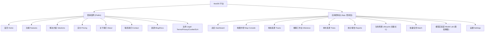

# 4estDS 前端规划方案

> 本文是 4estDS **前端/商业化平台**的权威规划,与代码仓库一起版本化。
> 后端核心引擎(阶段一~八)已完成;本文规划如何把这些能力包装成一个**商业级、专业、五脏俱全的 SaaS 平台**。
> 配套实时讨论见 Notion 计划页《4estDS 前端规划方案》。

**一句话目标**:把已做好的 4estDS 后端能力(切片 / 推理 / 多源融合 / 统计报告 / 单木生命周期追踪),包装成既有面向客户的**营销官网**(About / Contact / Pricing / 法务),又有面向作业人员的**应用控制台**(地图中控 / 推理工作台 / 数据管理 / 报告 / 生命周期)的商业平台。

---

## 0. 关于沙盒、构建与「完整代码」承诺

**关于「能不能像 Google AI Studio 那样直接编译预览」**:不能。AI Studio 的 Build 跑在 Google 云端,有外网、有托管的构建/预览服务;而当前执行沙盒是**离线隔离**的——虽装了 Node 24,但**无外网**,无法 `npm install` 拉取 React/Vite/MapLibre/deck.gl/Supabase 等依赖,自然也无法 `npm run dev` 起服务或在线展示。这是沙盒硬限制,不是工具不行。

**因此采用的策略(按需求)**:

- 假设你本地有完整前端环境,直接编写**完整、可运行的代码**(非骨架占位):`package.json`、配置、组件、样式、mock 数据层、类型、测试与 README。
- **完成定义(DoD)**:下载后本地 `npm install && npm run dev` 即可**无报错运行**;默认接入内置 **mock 数据适配层**(无后端即可看全部页面与交互),需要真实数据时一行配置切到 FastAPI。
- 沙盒内可做的验证:`tsc --noEmit` 类型检查、`prettier`/`eslint` 静态检查、纯逻辑单测。真正的浏览器构建与联调由你本地完成。

---

## 1. 信息架构(IA)与站点地图

产品分两大区:**① 营销官网(公开)** 与 **② 应用控制台(登录后)**,共用一套设计系统与品牌。



---

## 2. 技术选型(基于行业最佳实践与商业模板调研)

| 层 | 选型 | 理由 / 对标 |
|---|---|---|
| 框架 + 构建 | **React 19 + Vite + TypeScript** | 商业 SaaS 仪表盘事实标准;Vite 启动快、生态全 |
| UI 组件 | **shadcn/ui + Tailwind + Radix**(主);密集表格可借鉴 Ant Design Pro | shadcn/ui 为增长最快的现代 SaaS 仪表盘体系(代码自有、可深定制、内建暗色/Cmd+K/无障碍) |
| 路由 | **TanStack Router**(类型安全) | 现代 Shadcn Admin 默认搭配 |
| 服务端状态 | **TanStack Query** | 缓存/重试/失效 |
| 本地状态 | **Zustand** | 轻量,免 Redux 样板 |
| 表格 | **TanStack Table** | 排序/分页/虚拟化,适合海量单木行 |
| 图表 | **Tremor**(Vercel 已免费)+ Recharts 兜底 | 数据密集仪表盘成品图表块 |
| 地图 | **MapLibre GL JS + deck.gl** | deck.gl 官方与 MapLibre 同步相机;GPU 渲染海量树点/冠幅 |
| 大数据传输 | 矢量瓦片 / **PMTiles**;pbf/GeoArrow 而非裸 GeoJSON | >15MB 数据需渐进加载 |
| 表单 + 校验 | **react-hook-form + zod** | 类型安全、性能好 |
| 认证 | **Supabase Auth** | 沿用既定方案,替代自建 users |
| 国际化 | **i18next**(中/英) | 商业出海必备 |
| API 客户端 | **openapi-typescript**(从 FastAPI OpenAPI 生成) | 前后端类型契约统一 |
| 测试 | **Vitest + Testing Library + Playwright + MSW** | 单测/组件/E2E/接口 mock |
| 后端 API | **FastAPI** 复用核心引擎 | 与 CLI 共享 `fourestds` 核心 |

**主推**:`Vite + React + TS + shadcn/ui + Tailwind + TanStack + Tremor + MapLibre/deck.gl`,以 **Shadcn Admin** 这类开源商业模板为脚手架参考。若偏好开箱即用的企业密集表格,可整体切到 **Ant Design Pro**(待拍板)。

---

## 3. 营销官网(五脏俱全)

原则:**移动优先、以「成果」而非「功能」叙事、社会证明、清晰 CTA、透明定价、完整法务**。

### 3.1 页面清单

- **首页 Home**:Hero + 主 CTA、信任背书、核心能力(成果叙事)、How it works、典型场景、案例/数据、底部 CTA。
- **功能 Features**:智能解译、最优多尺度切片(A)、多源融合树高(B)、单木生命周期追踪(C)、统计报告、批量处理。
- **解决方案 Solutions**:红树林湿地监测、蓝碳/碳汇核算、林业资源普查、生态修复成效评估。
- **定价 Pricing**:体现 *"Don't gate by plans, gate by features"*;透明区间 + FAQ。
- **关于我们 About Us**:使命愿景、科研实力(三专利创新点)、团队、里程碑。
- **联系我们 Contact Us**:表单 + 邮箱/电话/地址 + 地图 + 工单入口。
- **资源 Resources**:博客 / 文档 / API 文档 / FAQ / 更新日志。
- **法务 Legal**:Terms of Service、Privacy Policy、Cookie 政策、DPA/Security、AUP、SLA。
- **全局**:顶部导航 + 语言切换 + 登录/注册;Footer 汇总全部链接(含备案信息)。

### 3.2 转化与信任要素

社会证明(客户 logo/案例/数据)、安全合规徽章、清晰主 CTA、移动端适配、首屏性能。

---

## 4. 应用控制台(把后端能力商业化呈现)

**App Shell**:顶栏(全局搜索 Cmd+K / 工作区切换 / 通知 / 主题 / 用户菜单)+ 左侧导航 + 面包屑;全页具备**空状态、骨架屏、错误边界、响应式**。仪表盘遵循「价值驱动而非堆功能」。

| 页面 | 核心内容 | 对应后端 |
|---|---|---|
| **总览 Dashboard** | KPI 卡(地块/单木/任务/总面积)、近期任务、地图缩略、健康概览 | db reader / run_logs |
| **地图中控 Map Console** | MapLibre+deck.gl;图层:footprint、单木点/冠幅多边形、CHM 热力;按 location/时相筛选 | tracts / observations / 几何 |
| **地块资源 Tracts** | 表格 CRUD;影像上传(RGB/DSM/DEM/多光谱)与多源登记;时相+location 唯一键 | tracts / tract_sources |
| **推理工作台 Inference** | 向导:选地块→架构(yolo12/rtdetr/mock)→切片参数→CHM 选项→提交;实时进度与日志;三件套 | infer / 切片 / 后处理 / run_logs |
| **单木资源 Trees** | tract_trees 表 + 地图联动;按物种/置信度/尺寸筛选;导出 shp/geojson/gpkg/csv | tract_trees / 导出 |
| **统计报告 Reports** | 树种组成、密度、冠幅/树高分布、生物量碳储量、NDVI 健康、分带/林窗;Tremor 图表;导出 md/pdf/csv | report 模块 |
| **生命周期 Lifecycle (核心)** | 时相滑块、个体生长曲线、新生/枯死地图 diff、个体详情 | tree_individuals / track |
| **批量任务 Batch** | 队列、一图一 run、串行进度 | batch 模块 |
| **模型实验室 Model Lab** | 训练/消融实验、结果归档(按功能授权解锁) | train(TODO) |
| **设置 Settings** | 工作区、成员、权益/计费、API Key、数据源 | Supabase / entitlements |

---

## 5. 后端 API 契约(FastAPI 桥接层)

复用 `fourestds` 核心(与 CLI 同一逻辑),FastAPI 暴露 REST + 任务接口;OpenAPI → 前端类型化客户端。

- `GET/POST /tracts`、`/tracts/{id}`、`/tracts/{id}/sources`(上传与登记)
- `POST /infer`(异步,返回 run_id)、`GET /runs/{id}`、`GET /runs/{id}/logs`(SSE/轮询实时日志)
- `GET /trees?tract&filters`、`POST /export`(shp/geojson/gpkg/csv)
- `GET /reports/{tract}`、`POST /lifecycle/track?location`、`GET /lifecycle/individuals`
- **鉴权**:`Authorization: Bearer <Supabase JWT>` + entitlement 中间件校验 feature key。

---

## 6. 授权与商业化(Supabase · 按功能解锁)

原则:**Don't gate by plans, gate by features.** 前端 `useEntitlement(featureKey)` 控制可见/可用,后端中间件二次校验。

- **认证**:Supabase Auth(邮箱 + OAuth),替代本地 users 表。
- **权益**:`entitlements` 表 + RLS;功能键示例:`feature.training`、`feature.batch`、`feature.multispectral`、`feature.export.shp`、`feature.api`、`feature.lifecycle.advanced`。
- 无权益时显示「升级解锁」占位而非直接隐藏。

---

## 7. 设计系统与品牌

- **色彩**:红树林/生态深绿 + 青色点缀;暗/亮双主题;数据可视化专用调色板(物种分类色 + 连续色阶)。
- **排版与图标**:无衬线中英字体;Lucide 图标。
- **密度模式**:舒适/紧凑。
- **可访问性**:WCAG AA;键盘可达;对比度达标。
- **国际化**:中/英;移动优先响应式。

---

## 8. 目录结构(monorepo,延续既定约定)

```
4estDS/
├── backend/4estds/        # 现有核心引擎(已完成阶段一~八)
├── api/                   # 新增 FastAPI 服务(复用 backend 核心)
├── frontend/              # 新增前端 (Vite + React + TS)
│   ├── src/
│   │   ├── app/           # 路由与页面(marketing/ + console/)
│   │   ├── components/    # 设计系统组件
│   │   ├── features/      # 业务域:tracts/infer/trees/reports/lifecycle
│   │   ├── lib/           # api 客户端 / supabase / map / utils
│   │   ├── mocks/         # MSW mock 数据层(无后端可跑)
│   │   ├── hooks/  stores/  i18n/  styles/
│   └── package.json  vite.config.ts  tsconfig.json
├── docs/  configs/  tests/
```

---

## 9. 质量 / 性能 / 安全

- **性能**:路由级代码分割、地图矢量瓦片/PMTiles、表格虚拟化、图片字体优化、CDN。
- **测试**:Vitest 单测、Testing Library 组件、Playwright E2E、MSW 接口 mock。
- **安全**:Supabase JWT + RLS、前后端双重权益校验、CSP、输入校验(zod)。
- **可观测**:前端错误监控 + 后端 run_logs 贯通。

---

## 10. 分阶段实施计划(阶段九拆子阶段,每点可独立 commit)

> 纪律:每个子阶段「下载即 `npm install && npm run dev` 无报错运行」,未完善处用 `TODO` 占位。

- [ ] **9.0 规划(本文档)** — 评审定稿 + 落盘 docs + 提交
- [ ] **9.1 前端工程底座 + 设计系统** — Vite/TS/Tailwind/shadcn、主题、布局、i18n、mock 层、CI 类型检查
- [ ] **9.2 营销官网完整** — 首页/功能/解决方案/定价/About/Contact + 全部法务页 + Footer + 响应式 + 中英
- [ ] **9.3 API 层 + Auth** — FastAPI 接口契约 + openapi 类型客户端 + Supabase 登录/注册/会话
- [ ] **9.4 App Shell + Dashboard + 地图中控** — 导航/搜索/主题 + KPI 总览 + MapLibre/deck.gl 图层
- [ ] **9.5 地块管理 + 推理工作台** — Tracts CRUD/上传 + Inference 向导 + run_logs 实时进度
- [ ] **9.6 单木资源 + 报告可视化 + 导出** — Trees 表/地图联动 + Reports 图表 + 多格式导出
- [ ] **9.7 生命周期旗舰页(创新点 C)** — 时相滑块 + 生长曲线 + 新生/枯死 diff
- [ ] **9.8 授权/计费 + 模型实验室(gated)** — entitlements + feature 中间件 + 训练页授权解锁
- [ ] **9.9 打磨与交付** — 性能/可访问性/测试/部署文档

---

## 11. 风险与待拍板的开放问题

1. **UI 体系最终选型**:`shadcn/ui + Tailwind`(推荐)还是 `Ant Design Pro`(企业密集表格开箱即用)?
2. **地图底图与瓦片**:自建 PMTiles / 开源底图,还是接商业地图服务?是否需要广东省真实底图与行政边界?
3. **营销站与 App**:同仓单应用(路由分区)还是分仓两套部署?
4. **中英双语**:首版双语,还是先中文、英文留 TODO?
5. **Supabase 区域与合规**:面向国内访问的可达性/备案与数据合规?

---

## 12. 设计依据(行业最佳实践与商业模板)

- React 仪表盘模板与体系:Shadcn Admin、28 Best React Admin Templates 2026、shadcn vs MUI vs Ant Design、Tremor / Untitled UI 榜单
- SaaS 仪表盘 UX:From Features to Value (UXmatters)、Esri 有效仪表盘设计
- B2B SaaS 官网与定价/法务:SaaS Landing Page 范例库、B2B SaaS 官网最佳实践、SaaS 服务条款指南
- 地图技术:deck.gl × MapLibre 官方指南、deck.gl + React
- 行业对标(林木遥感平台):Overstory、Planet Insights Platform、Meta×WRI 1m 树冠高度
