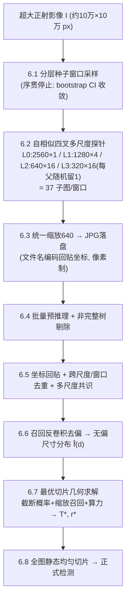
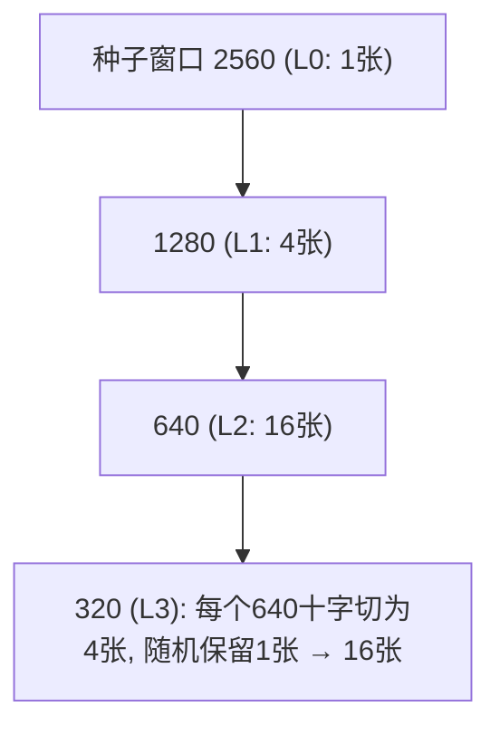

# 自标定自适应切片 SCOPE — 专利查新报告与创新设计方案

<aside>
🔭

**一句话**：从超大正射影像中以分层抽样选取少量大窗口，对每个窗口做自相似四叉多尺度裁剪以低成本探测全场目标尺寸分布，经检测器召回反卷积去偏后，用截断概率—缩放召回—算力的闭式联合优化，自动解出对整图正式切片的最优 tile 尺寸与重叠率。代号 **SCOPE**(Self-Calibrating Optimal Patch-size Estimation)。

</aside>

## 一、发明名称与代号

- **建议专利标题（中文）**：一种面向超大正射影像小目标检测的自标定自适应切片方法及系统
- **英文 / 代号**：**SCOPE** — *Self-Calibrating Optimal Patch-size Estimation*
- **一句话定位**：用「少量大窗口 + 四叉多尺度探针」自标定出最优切片几何，免预设目标尺寸范围、免人工设定切片尺寸。

<aside>
📌

名称与代号为提案，可按需替换。下文按"全新独立设计"撰写。

</aside>

## 二、技术领域

本发明属于**遥感图像处理与计算机视觉目标检测**交叉领域，具体涉及**超大尺幅正射影像（量级约 10⁵×10⁵ 像素）中密集小目标（如单木树冠）的切片式（tiling / sliced inference）检测**，尤其涉及切片几何（tile 尺寸、重叠率）的自动标定与优化。

## 三、要解决的技术问题

1. **超大图无法整图送入检测器**，必须切片；但切片尺寸/重叠若设置不当，小目标在缩放后消失、大目标被边界截断、或算力浪费。
2. **目标的真实像素尺寸高度依赖采集条件**（航高、GSD），无法预先假设一个固定范围（如"30–500px"），手填的切片尺寸列表不具普适性。
3. **检测器对不同尺寸目标的召回不一致**，直接统计检测结果会得到有偏的尺寸分布，导致切片几何选错。
4. **需在不显著增加推理算力**的前提下完成上述标定（探测开销应远小于一次全图推理）。

## 四、检索说明（查新）

| 项目 | 内容 |
| --- | --- |
| 检索数据库 | Google Scholar、arXiv、IEEE Xplore、MDPI、ScienceDirect、Google Patents、CNKI（建议正式申请前补检） |
| 检索时间范围 | 至 2026-06 |
| 中文检索式（示例） | (遥感 OR 正射影像) AND (切片 OR 分块 OR tiling) AND (尺寸 OR 尺度 OR 重叠) AND (优化 OR 自适应) AND (小目标 OR 树冠 OR 单木) |
| 英文检索式（示例） | (remote sensing OR orthomosaic) AND (tiling OR slicing OR "sliced inference") AND ("tile size" OR overlap OR scale) AND (adaptive OR optimal OR calibration) AND ("small object" OR "tree crown") |
| IPC 参考分类 | G06V 20/10（场景/遥感图像）、G06T 7/00（图像分析）、G06V 10/25/77（区域/特征处理） |

## 五、现有技术综述与对比文件

| 对比文件 / 路线 | 核心做法 | 与本发明（SCOPE）的区别 |
| --- | --- | --- |
| SAHI（Akyon 2022）固定切片 | 人工设定固定 slice 尺寸 + 固定重叠（常用 25%）后推理融合 | SCOPE 不预设尺寸，由数据自标定最优尺寸与重叠 |
| DAHI 密度引导 / HAB‑DMC 场景热力自适应分块 | 逐图在线用密度图/热力图决定分块，区域级级联推理 | SCOPE 为离线、静态、可批处理的几何标定；不做逐图在线区域提议，无级联吞吐瓶颈 |
| ScaleBridge‑Det | 尺度自适应专家路由 + 密度引导 query 分配（改网络结构） | SCOPE 是检测器无关的前处理切片策略，不改网络 |
| Flip‑n‑Slide（ICLR24 ML4RS） | 多位置/多朝向的多视位切片以保留上下文 | SCOPE 含去偏尺寸分布估计与截断概率优化，目标是选几何而非多视位增强 |
| 尺度空间 / Lindeberg γ‑归一化尺度选择 | 特征尺度自动选择的经典理论 | SCOPE 借其界定检测器可靠尺度带，创新在标定流水线与优化目标，非尺度选择本身 |
| 单木检测（DeepForest / ITCD 综述） | RGB 树冠检测模型与基准 | SCOPE 是其上游的切片几何标定，二者正交、可叠加 |
| CN113591766A | 无人机多源遥感 + CHM 判种 | 与本发明切片几何标定不冲突；正式申请前需回避 |

## 六、整体技术方案



### 6.1 分层种子窗口采样 + 序贯停止

- 在全图上**空间分层**（按规则网格 / 植被指数或纹理分层）随机选取边长 `w=2560` 的种子窗口；用 **nodata 掩膜的积分图** 做 O(1) 有效性判定，按 nodata 占比阈值 ε 取舍（非零容忍，避免林缘偏差）；避免与已采样区域有重叠。
- **分轮采样**：每轮加 `Δ=4` 个分层窗口（粒度可调），而非逐个。
- **序贯停止**：每轮后用累计窗口重算无偏分布 f̂(d) 与决策量 θ（取 `d_q95` 或解出的 `T*`），对"已采窗口"做 bootstrap（B≈200 次）估 θ 的置信区间；当 **CI 半宽 < 容差 且 相邻两轮相对变化 < ε**，或达到窗口预算上限时停止。

### 6.2 自相似四叉多尺度探针（37 子图结构）



- 对每个种子窗口做自相似四叉裁剪，深度 `K=3`：L0=1、L1=4、L2=16、L3=16。
- **冗余抑制规则**：最后一次被十字切的图像（即每个 640 子图）切出的 4 张 320 子图**只随机保留 1 张**，使 **L3(320) 与 L2(640) 数量相等（各 16 张）**。
- 每窗口合计 **37 张**子图，全部为静态、可一次性批量推理，**无数据依赖的在线递归**。

### 6.3 子图落盘与命名规范（JPG · 像素制）—— 坐标回贴关键

- 所有子图**统一缩放到 640×640 并以 JPG 落盘**；缩放与反缩放**一律基于像素**，不引入米制单位。
- 文件名编码回贴所需的全部信息，**ASCII、整数坐标、`__` 双下划线分隔、不含空格与中文**：

```
<sceneId>__w<windowId>__L<level>__o<gx>_<gy>__s<T>__r640.jpg

示例: mangroveA__w007__L3__o53760_22400__s320__r640.jpg
  sceneId  = mangroveA      源正射影像标识(支持多源)
  windowId = 007            第7个种子窗口(用于跨尺度共识/去重分组)
  level    = 3              四叉深度(对应可靠尺寸带)
  gx,gy    = 53760,22400    该子图左上角在【全图】中的像素坐标  ← 回贴关键
  T        = 320            子图原生边长(全图像素尺度) → 缩放比 = T/640
  r640     = 640            推理分辨率(恒定, 显式写出防错)
```

- **回贴公式**（检测框在 640 子图内为 `bx,by,bw,bh`）：

$$
\text{scale}=\frac{T}{640},\quad X=g_x+b_x\cdot\text{scale},\;\; Y=g_y+b_y\cdot\text{scale},\;\; W=b_w\cdot\text{scale},\;\; H=b_h\cdot\text{scale}
$$

- 即使 L3 每父仅留 1 张，其 `(gx,gy)` 唯一确定是哪一张，回贴无歧义。

### 6.4 批量预推理 + 非完整树剔除

- 以 mini-batch（24G 显存下 640px、fp16 建议 B=32~64）批量预推理全部子图。
- **非完整树剔除**（标志该子图层级对该目标过细）：
    - **几何主判据**：检测框面积 / 所在子图面积 `> 0.9` → 判为非完整树，舍弃；
    - **光谱弱辅判据（可选）**：框内绿度 `> 0.95` 作为次级参考（注意密林同样高绿度，仅作辅助、不单独决定）。

### 6.5 坐标回贴 + 跨尺度/窗口去重 + 多尺度共识

- 用文件名解码把所有保留检测回贴到全图像素坐标。
- **跨尺度/窗口去重**：同一全图位置（IoU > 阈值）的检测判为同一棵树，合并。
- **多尺度一致性共识**：一棵真树应在其表观尺寸落入甜区的若干层被一致检出；以"被 ≥k 个尺度一致检出"作为置信加权（既提估计质量，亦为独立创新点）。

### 6.6 召回反卷积去偏 → 无偏尺寸分布 f̂(d)

- 预先标定**检测器召回–表观尺寸曲线 R(a)**（贴入已知尺寸合成目标或用标注探测块测得，仅一次）。
- 对每层在其**可靠表观区间**内按 R 的倒数反卷积重加权，再映射回真实尺寸并跨层融合：

$$
\hat n(a)=\frac{h(a)}{R(a)},\qquad d=a\cdot\frac{T}{640},\qquad \hat f(d)\propto \sum_{L} w_L(d)\,\hat n_L\!\big(\tfrac{640\,d}{T_L}\big)
$$

其中 `w_L(d)` 为第 L 层在尺寸 d 处的可靠度权重（甜区内为 1，区外衰减），避免 R→0 区间的数值发散。

### 6.7 最优切片几何求解（单一 T* 默认；离散尺度集为兜底）

见第七节模型。**默认输出单一最优 (T*, r*)**；仅当 f̂(d) 过宽/多峰、单一尺度无法覆盖时，自动退化为最小离散尺度集（集合覆盖，K>1）。

### 6.8 全图静态均匀切片 → 正式检测

以 `T*`、步距 `T*(1-r*)` 对全图做**静态均匀网格**切片（积分图跳过 nodata 块），批量推理后用尺度感知 WBF 融合、回贴入库。

## 七、关键数学模型

**(1) 边界截断概率**（窗口 T、重叠 o=rT、步距 s=T(1-r)，目标位置均匀）：

$$
P_{cut}(d;T,r)=\mathrm{clip}\!\left(\frac{d-rT}{T(1-r)},\,0,\,1\right)
$$

**(2) 缩放后召回**：表观尺寸 `a=640·d/T`，召回 `R(a)`。

**(3) 联合目标函数**（A 为全图像素面积，λ 为算力权重）：

$$
\max_{T,r}\; J=\int \hat f(d)\,R\!\left(\tfrac{640\,d}{T}\right)\bigl(1-P_{cut}(d;T,r)\bigr)\,dd\;-\;\lambda\,\frac{A}{T^{2}(1-r)^{2}}
$$

低维，网格/解析即可求解。

**(4) 尺寸感知重叠**（保证高分位尺寸不被截断）：

$$
r^{*}\ge \frac{d_{q95}}{T}
$$

**(5) 离散最优尺度集（一般式，K=1 为特例）**：选最少的 `{T_1..T_K}` 使 f̂(d) 的尺寸质量被各尺度甜区覆盖且总 tile 数最小——典型集合覆盖/设施选址问题；当单一 T 即可覆盖 ≥95% 尺寸质量时自动塌缩为 K=1。

## 八、算法伪代码

```
输入: 影像 I(W×H px), 检测器 D, 召回曲线 R(a), 推理分辨率 P=640
      窗口 w=2560, 四叉深度 K=3, 每轮窗口 Δ=4
# ---- 阶段1: 自标定探测 ----
windows = []
repeat:
    new = stratified_sample(I, Δ, reject_by_nodata_integral_image)
    windows += new
    crops = []
    for win in new:
        for L in 0..K:
            tiles = quadtree_nodes(win, L)              # L 层共 4^L 个
            if L == K:                                  # 最深层每父随机留1
                tiles = [random_pick(children) for parent in level_{K-1}]
            for t in tiles:
                jpg = resize_to(t, P)                    # 像素制缩放
                name = encode(scene, win.id, L, t.gx, t.gy, t.size)
                save_jpg(jpg, name); crops.append((jpg, name))
    dets = batch_infer(D, crops, B=32..64)
    dets = reject_incomplete(dets, area_ratio>0.9 or greenness>0.95)
    dets = backproject(dets)                             # 由文件名解码
    dets = dedup_and_consensus(dets, iou_thr)            # 跨尺度/窗口
    f_hat = deconv_estimate(dets, R)                     # n̂(a)=h(a)/R(a) 融合各层
    theta = solve_geometry(f_hat).T_star
    ci = bootstrap_CI(theta, windows, B=200)
until ci.halfwidth < tol AND rel_change(theta) < eps  OR  len(windows) >= budget
# ---- 阶段2: 求最优几何 ----
(T*, r*) = argmax J(T, r; f_hat)        # 截断+缩放召回+算力; 默认K=1, 必要时集合覆盖
# ---- 阶段3: 正式切片 ----
grid = uniform_tiles(I, T*, stride=T*(1-r*), skip_nodata_by_integral_image)
out  = batch_infer(D, resize_to(grid, P)); backproject; scale_aware_WBF(out)
```

## 九、尺寸覆盖与时间复杂度

**尺寸覆盖**（检测器甜区按表观 16–256px 估）：

| 层 | tile(px) | 缩放 s=640/T | 可靠真实尺寸 d≈[16,256]/s | 张数 |
| --- | --- | --- | --- | --- |
| L0 | 2560 | 0.25 | 64 – 1024 px | 1 |
| L1 | 1280 | 0.5 | 32 – 512 px | 4 |
| L2 | 640 | 1.0 | 16 – 256 px | 16 |
| L3 | 320 | 2.0 | 8 – 128 px | 16 |
| 合计 | — | — | 并集 ≈ 8 – 1024 px（自动横跨各航高） | 37 |

**算力 / 时间**（每窗口 37 张；空间覆盖率仅由种子窗口决定，每窗口 0.0655%）：

| 目标覆盖率 c | 种子窗口 N=c×1527 | 子图总数 (×37) | 预推理纯算力* |
| --- | --- | --- | --- |
| 0.5% | 8 | 296 | ~1s |
| 1%（建议） | 16 | 592 | ~2s |
| 2% | 31 | 1147 | ~4s |

<aside>
⏱️

*按 ~300 img/s 保守批量吞吐估；墙钟另受大 GeoTIFF 窗口读取 I/O 影响，量级约 10–30s。对照一次全图正式推理（约 1.5万–2.4万 tile，数十秒计算 + 分钟级 I/O），探测开销约为其 5–10%。建议落点 c≈1%（16 窗口）**：约 1000+ 棵树、空间铺得开、性价比最佳。

</aside>

## 十、技术效果

1. **免预设目标尺寸范围 / 跨航高自适应**：多尺度探针并集自动覆盖 ~8–1024px，飞高飞低均由相应层级点亮。
2. **无偏尺寸分布**：召回反卷积消除检测器尺寸偏好导致的统计偏差。
3. **提升小目标召回、抑制边界截断误检**：由联合目标显式权衡。
4. **低算力**：探测仅占一次全图推理的约 5–10%；正式切片为静态均匀网格，GPU 批处理拉满，无在线递归瓶颈。
5. **工程可落地**：JPG 落盘 + 文件名编码回贴，像素制全程一致，易复现、易并行。

## 十一、权利要求书（骨架）

**独立权利要求 1（方法）**：一种面向超大正射影像小目标检测的自标定自适应切片方法，其特征在于包括：

1. (a) 以空间分层抽样从影像中选取若干边长为 w 的种子窗口，并以 nodata 掩膜积分图按占比阈值剔除无效窗口；
2. (b) 对每个种子窗口生成自相似四叉多尺度子图集合，其中在最深一次十字切分处，每个父子图所产生的子图仅随机保留一张，使最深层子图数量等于其上一层子图数量；
3. (c) 将全部子图统一缩放至固定推理分辨率并以有损压缩格式落盘，其文件名编码各子图在全图中的像素坐标原点与原生像素尺寸；
4. (d) 对全部子图批量预推理，并依据检测框与所在子图的面积比阈值和/或绿度阈值剔除非完整目标；
5. (e) 依据文件名将保留检测回贴至全图像素坐标，并按空间重叠跨尺度与跨窗口去重，以多尺度一致检出作为置信度；
6. (f) 以预先标定的检测器召回–表观尺寸曲线之倒数对检测计数反卷积重加权并跨尺度融合，得到无偏目标尺寸分布；
7. (g) 分轮追加分层窗口并重算决策统计量，至其自举置信区间收敛时停止（序贯停止）；
8. (h) 求解由边界截断概率、缩放后召回与算力代价构成的联合目标，输出最优切片尺寸与重叠率，其中以离散尺度集为一般形式并在单尺度足够时退化为单一尺度；
9. (i) 以所得几何对全图做静态均匀切片并检测、回贴。

**从属权利要求（示例）**：

- 权 2：w=2560、四叉深度为 3，各层子图数为 1/4/16/16，单窗口共 37 张。
- 权 3：文件名格式为 `场景__窗口__层级__原点坐标__原生尺寸__推理分辨率`，回贴按 scale=原生尺寸/推理分辨率 线性映射。
- 权 4：召回反卷积仅在各尺度可靠表观区间内进行，区外以衰减权重融合。
- 权 5：序贯停止以 d_q95 或最优 tile 尺寸为决策统计量，自举估计其置信区间。
- 权 6：重叠率满足 r ≥ d_q95 / T 的尺寸感知约束。
- 权 7：非完整目标剔除以面积比 >0.9 为主判据、绿度 >0.95 为辅判据。
- 权 8：离散尺度集求解建模为集合覆盖，单尺度覆盖率 ≥95% 时取单一尺度。
- 权 9：子图以 JPG 落盘，缩放与反缩放均基于像素单位。
- 权 10：以 nodata 积分图对种子窗口与正式切片块做 O(1) 有效性筛除。
- **系统权利要求**：一种实现上述方法的系统/装置，及存储相应程序的计算机可读介质。

## 十二、附图说明

- 图1：总体流程图（见 6 节）。
- 图2：自相似四叉多尺度探针结构（见 6.2）。
- 图3：子图文件名编码与坐标回贴示意（见 6.3）。
- 图4：尺寸覆盖–层级对应关系（见第九节表）。
- 图5：联合目标函数 J(T,r) 等高线与最优点示意。

## 十三、实施例

- 影像：约 100,000×100,000 px 红树林无人机正射镶嵌图，含不规则 nodata 边界。
- 参数：w=2560、K=3、Δ=4、P=640、覆盖率 c≈1%（≈16 窗口、≈592 子图）。
- 标定：批量预推理 ~2s（B=48，fp16）；序贯停止于 12 窗口（bootstrap CI 半宽 < 5%）。
- 求解：f̂(d) 单峰落于单尺度甜区 → 输出单一 T*（如 1024px）+ r*（如 0.22，满足 r≥d_q95/T）。
- 正式切片：静态均匀网格 + 尺度感知 WBF 融合回贴入库。

## 十四、查新结论与创造性论证

- **新颖性**：未检索到将「自相似四叉多尺度探针 + 召回反卷积去偏的尺寸分布估计 + 截断概率/缩放召回/算力联合优化的切片几何求解」整合为一体的在先技术。
- **创造性（相对最接近对比文件）**：
    - 相对 SAHI（固定切片）：本发明**自标定**尺寸与重叠，非人工设定。
    - 相对 DAHI / HAB‑DMC（逐图在线自适应）：本发明为**离线、静态、可批处理的摊销标定**，无级联推理瓶颈。
    - 创造性高度集中于 **去偏分布估计 + 截断概率联合优化 + 多尺度一致性共识**，并带来可量化技术效果（召回↑、截断误检↓、算力↓）。

## 十五、审查风险与规避

<aside>
⚠️

- **防"智力活动/数学方法"驳回（专§25）**：权利要求叙及读取超大 GeoTIFF、积分图筛选、JPG 落盘、GPU 批量推理、文件名编码回贴入库等实体步骤，使数学锚定于具体图像处理流程与可测工程效果。
- **防"显而易见组合"驳回**：避免把权项落在"图像金字塔 + SAHI"层面；创造性应压在去偏估计、截断概率目标、跨尺度共识上，并强调跨航高免标定的非显而易见效果。
- **回避在先专利**：正式申请前在 CNKI/Google Patents 对 CN113591766A 等做针对性查新与权项规避。
- **魔法数字一般化**：实施例可写具体数值，但权项主张机制层面一般形式，防对手改数绕开。
</aside>

## 十六、参考文献

1. Akyon et al., *Slicing Aided Hyper Inference and Fine-tuning for Small Object Detection* (SAHI), ICIP 2022. [链接](https://docs.ultralytics.com/guides/sahi-tiled-inference)
2. Suárez-Ramírez et al., *DAHI: a fast and efficient density aided hyper inference technique for large scene object detection*, 2025. [链接](https://www.sciencedirect.com/science/article/pii/S0031320325008891)
3. *Scene Heatmap-Guided Adaptive Tiling and Dual-Model Collaboration (HAB-DMC)*, MDPI 2025. [链接](https://www.mdpi.com/2073-8994/17/12/2158)
4. *ScaleBridge-Det: Balanced Tiny and General Object Detection in Remote Sensing*, arXiv 2025. [链接](https://arxiv.org/html/2512.01665v1)
5. Abrahams et al., *Flip-n-Slide: A Concise Tiling Strategy for Preserving Spatial Context*, ICLR 2024 ML4RS. [链接](https://ml-for-rs.github.io/iclr2024/camera_ready/papers/13.pdf)
6. Unel et al., *The Power of Tiling for Small Object Detection*, CVPRW 2019. [链接](https://openaccess.thecvf.com/content_CVPRW_2019/papers/UAVision/Unel_The_Power_of_Tiling_for_Small_Object_Detection_CVPRW_2019_paper.pdf)
7. *Impact of Tile Size and Tile Overlap on CNN Prediction Performance*, MDPI Remote Sensing 2024. [链接](https://www.mdpi.com/2072-4292/16/15/2818)
8. Weinstein et al., *Individual Tree-Crown Detection in RGB Imagery (DeepForest)*, bioRxiv. [链接](https://www.biorxiv.org/content/10.1101/532952v5.full-text)
9. Zheng et al., *A review of individual tree crown detection and delineation*, arXiv 2310.13481. [链接](https://ar5iv.labs.arxiv.org/html/2310.13481)
10. *CN113591766A 无人机多源遥感树种识别方法*. [链接](https://patents.google.com/patent/CN113591766A/en)
11. T. Lindeberg, *Feature detection with automatic scale selection*（γ‑归一化尺度选择，经典理论）.