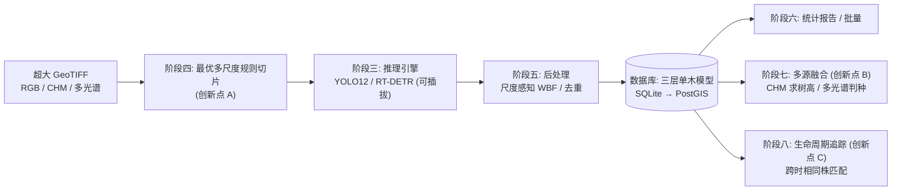

# 4estDS 技术方案(实时方案快照)

> 本文是项目的**权威技术方案**,从 Notion 规划页沉淀而来,随代码仓库一起版本化。
> 面向维护者与评审者;想快速看懂"怎么跑起来的",请看 `docs/项目工作原理.md`(文件A)。

---

## 1. 项目目标

从超大正射影像(GeoTIFF)中,**自动、可追溯地解译每一棵红树**,量出位置/冠幅/树高/物种,并**跨时相追踪单木生命周期**(生长、新生、枯死)。面向长期、可商业化的业务。

## 2. 总体架构



## 3. 数据底座:三层单木模型

为解决"重复推理污染"——同一棵树在多张子图/多次 run 中被反复检出——采用三层:

```
tree_observations   原始观测(可重复;每次 run / 每个切片都记)
      │  同一时相择优去重
      ▼
tract_trees         地块规范单木(某时相的"权威"株)
      │  跨时相同株匹配
      ▼
tree_individuals    跨时相独立个体(生命周期 / 生长轨迹)
```

辅助表:
- `run_logs`:全任务可追溯(run_id / parent_run_id / task_type / model_arch / status / metrics_json / error …)。
- `tracts`:地块(一幅影像),**`acquisition_time`(YYYYMM) + `location` 联合唯一**。含 GSD/CRS/geotransform/bounds/nodata/dtype/footprint_geom 等元数据。
- `tract_sources`:一个地块的多个源文件(RGB / CHM / 多光谱)。

设计要点:
- 实现分两套:本地 SQLAlchemy 2.0 ORM(`db/models.py`)+ 最小环境标准库 sqlite3 DDL(`db/schema.py`)。
- 几何列在 SQLite 阶段以 WKT/GeoJSON 文本存储,迁移 PostGIS 后转原生几何(GeoAlchemy2)。
- 迁移:Alembic(TODO)。

## 4. 三大创新点

### 创新点 A — 最优多尺度规则切片(阶段四,核心已实现)
给定影像 GSD 与检测器输入尺寸,**用数学算出最优切片边长 T\* 与重叠 o\***,而非拍脑袋设 1024/0.2。流水线:
GSD 归一 → (可选)Lindeberg 特征尺度 → log 域尺度聚类得离散最优尺度集 → 截断概率约束优化求 (T\*,o\*) → 规则四叉树分层 → 尺度感知 WBF。nodata 积分图 O(1) 跳过空白。

**优化目标**(对每个尺度档):
```
minimize   cost(T,o) = 算力代价(∝ 1/(T−o)²) + λ·期望截断
subject to (可检测性) T ≤ model_input·scale_px / d_min
           (完整性)   截断概率(w_large, T, o) ≤ ε
```

### 创新点 B — 多源跨模态融合(阶段七)
RGB + CHM/多光谱。检测框 → 冠幅多边形;**CHM = DSM − DEM** 给出树高;多光谱辅助物种判别。

### 创新点 C — 单木生命周期追踪(阶段八,最核心价值)
跨时相同株匹配(位置+冠幅+物种代价)→ 生长曲线 / 新生 / 枯死事件识别。这是项目最具科研与商业价值的创新点。

## 5. 模型:双架构可插拔

`detect/` 下 `BaseDetector` 抽象 + 注册表,CLI `--arch yolo12|rtdetr|mock` 选后端。上层(切片、后处理、入库)对具体架构无感知。重依赖(ultralytics/torch)延迟导入。`mock` 后端用于无 GPU/无网环境的端到端测试。

## 6. 商业化授权(规划)

采用 Supabase Auth 取代自建 users 表;权限按**功能(feature)**而非套餐(plan)授权——*"Don't gate by plans, gate by features"*。`entitlements` + RLS / Edge Function 控制每个功能键,FastAPI 中间件校验 JWT 与 feature key。(TODO,后期阶段)

## 7. 阶段路线图(原 11 步 → 8 步)

| 阶段 | 状态 | 内容 |
|---|---|---|
| 一 底座 | ✅ 可用 | 配置/路径/日志/CLI 骨架,运行期目录 `~/.4estDS` |
| 二 数据库 | ✅ 可用 | 三层单木模型建表 + ORM(`db init` 可用) |
| 三 推理引擎 | 🟡 进行中 | BaseDetector + 双后端 + mock + 切片清单推理编排 |
| 四 创新点A | ✅ 核心已实现 | 切片优化数学核心(可单测) |
| 五 后处理 | 🟡 骨架 | 尺度感知 WBF 基础实现 |
| 六 报告/批量 | 🟡 骨架 | 统计汇总函数;出图与导出 TODO |
| 七 创新点B | 🟡 骨架 | CHM 求树高标量已有;接入栅格 TODO |
| 八 创新点C | ✅ 可用 | 匈牙利最优匹配(无 scipy)+ 生长轨迹 + 新生/枯死;`track` 子命令落库 |
| 九 前端平台 | 📐 规划 | 商业级 SaaS:营销官网 + 应用控制台 + FastAPI + Supabase 授权,见 `docs/4estDS前端规划方案.md` |

## 8. 部署与运行

```bash
uv sync                              # 仅核心
uv sync --extra geo --extra yolo --extra infer --extra db   # 按需
4estds db init
4estds preprocess
4estds infer --arch mock --image <path>
pytest -q
```

运行期目录默认 `~/.4estDS`(可用 `FOURESTDS_HOME` 覆盖),子目录 `config/cache/logs/db/outputs/models/tmp`。

## 9. 工程原则(贯穿全项目)

- **依赖克制**:核心仅标准库 + PyYAML;重依赖按模块分组可选,运行时"装了就用、没装回退"。
- **图像中间产物谨慎对待**:切片阶段只产出**坐标清单(manifest)**,不落地海量裁切图;正式推理用窗口读(window read)按需取像素,默认不写裁切文件;临时产物统一放 `tmp/` 并可清理。
- **边界兜底**:对空图、超界 tile、零/负 GSD、全 nodata、退化尺度等都有防御与回退。
- **可追溯**:每次运行写 `run_logs`;每个观测带 run_id 与来源切片。
- **可独立提交**:每个改动都保证能跑、能测;未完成功能以 `TODO` 显式标记。
