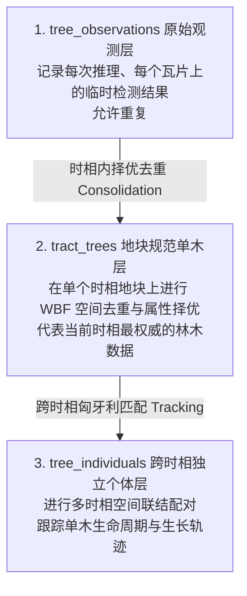

# 4estDS 数据库表设计与工作机制

本项目采用了一套工业级的“三层单木空间数据库”架构，用以解决大范围森林资源监测、多时相数据比对时容易出现的“重复推理污染”、“单木实体生命周期无法追溯”等痛点问题。

---

## 1. 核心架构设计：三层单木模型

空间林木数据在系统中以“观测级 ➔ 地块级 ➔ 个体级”三层形式渐进式存储与去重：

---

## 2. 表设计说明

系统目前共设计了 6 张表。表结构使用标准库 `sqlite3` 进行管理，并在 ORM 层（SQLAlchemy）提供了对应的类映射。

### ① 运行日志表 `run_logs`
* **作用**：记录所有推理、训练、数据导出等任务的执行记录。支持任务的追溯、重现与状态观测。
* **核心字段**：
  * `run_id` (TEXT, PK)：运行的唯一识别哈希（通常为 5 位）。
  * `task_type` (TEXT)：任务类型（如 `infer`, `train`, `export`, `track`）。
  * `status` (TEXT)：运行状态（`running`, `succeeded`, `failed`）。
  * `input_path` (TEXT)：输入的影像文件物理路径（用于空间投影自动回溯）。
  * `metrics_json` (TEXT)：运行指标度量数据的 JSON 文本。

### ② 地块信息表 `tracts`
* **作用**：代表一幅被处理的航空/卫星影像，是空间数据的核心地理宿主。由 `acquisition_time` (时相) 与 `location` (位置) 联合唯一确定。
* **核心字段**：
  * `tract_id` (TEXT, PK)：地块 ID（由 `name` + `acquisition_time` + 随机哈希自动生成）。
  * `acquisition_time` (TEXT)：时相，格式通常为 `YYYYMMDD` 或 `YYYYMM`。
  * `location` (TEXT)：位置标识。
  * `crs_epsg` (INTEGER) & `crs_wkt` (TEXT)：水平地理空间参考系统的 EPSG 编码及完整 WKT 定义（用以生成完整的 Shapefile 投影文件 `.prj`）。
  * `geotransform` (TEXT)：仿射变换矩阵（GDAL 6参数）。

### ③ 地块数据源注册表 `tract_sources`
* **作用**：登记一个地块关联的多源栅格与矢量数据文件（如 RGB 正射图、DSM 高程图、DEM 高程图、CHM 冠幅高度图等）。
* **核心字段**：
  * `source_id` (TEXT, PK)：数据源唯一 ID。
  * `tract_id` (TEXT, FK)：关联的地块。
  * `source_type` (TEXT)：类型（如 `rgb`, `dsm`, `dem`, `chm`）。
  * `path` (TEXT)：该文件的物理存储绝对路径。

### ④ 原始观测表 `tree_observations`
* **作用**：存储每一次推理产生的原始冠幅检测框及属性信息。允许包含重叠滑窗带来的重复检测。
* **核心字段**：
  * `obs_id` (TEXT, PK)：观测 ID。
  * `tract_id` (TEXT, FK)：所属地块。
  * `run_id` (TEXT, FK)：来自哪次推理运行。
  * `geom_point` (TEXT) & `geom_crown` (TEXT)：林木中心点和冠幅多边形的 **WKT 空间参考几何文本**。
  * `crown_area_geo` (REAL)：真实的冠幅投影投影面积（㎡）。
  * `height` (REAL) & `crown_volume_geo` (REAL)：树高及树木蓄积体积。

### ⑤ 地块规范单木表 `tract_trees`
* **作用**：由原始观测去重合并后产生的、在当前时相的“权威”林木实体表。
* **核心字段**：
  * `canonical_id` (TEXT, PK)：规范木唯一 ID。
  * `tract_id` (TEXT, FK)：所属地块。
  * `individual_id` (TEXT, FK)：联结的跨时相独立个体。
  * `chosen_obs_id` (TEXT)：择优被选用的原始观测的 `obs_id`。
  * `active_run_id` (TEXT)：当前活跃的 `run_id`。

### ⑥ 跨时相独立个体表 `tree_individuals`
* **作用**：用于在多个时相比对（例如 2024 年与 2026 年）时，标记并跟踪同一棵树。
* **核心字段**：
  * `individual_id` (TEXT, PK)：独立个体 ID。
  * `first_seen` (TEXT) & `last_seen` (TEXT)：首次及最后一次观测到的时相。
  * `status` (TEXT)：个体生命状态（如 `alive`、`dead`）。
  * `growth_json` (TEXT)：记录单木在多个时相期间高度、冠幅面积变化的历史增长轨迹。

---

## 3. 表之间如何相互协调和工作

系统的业务流程主要包含以下三个核心协同机制：

### 协同一：影像推理与原始数据写入 (`infer` 流程)
1. 系统运行 `4estds infer <image_path>`，通过 `ensure_tract` 校验并创建对应的地块（写入 `tracts`）。
2. 在推理过程中，瓦片切片检测出的所有单木框通过地理逆仿射变换转换成大地坐标，产生 WKT 点/多边形文本。
3. 调取 `write_observations`，将这些原始单木记录插入 `tree_observations`，每一行都携带 `run_id` 和 `tract_id`。

### 协同二：时相内单木规范化去重 (`Consolidation` 流程)
1. 数据写入完毕后，系统通过 `consolidate_tract_trees` 将本轮 `run_id` 下属于同一个地块的所有观测记录调出。
2. 在地理空间上执行 WBF (加权框融合) 和 NMS，将由于滑窗重叠等产生的多余检测框合并。
3. 保留置信度最高或尺寸最优的单木，将其属性登记至 `tract_trees`，建立与 `tree_observations.obs_id` 的关联。

### 协同三：多时相生命轨迹追踪与垃圾回收 (`track` 与 `clean` 流程)
1. 当有同一位置的多个时相数据时，运行 `4estds track`，系统提取该位置下不同时相地块的 `tract_trees`。
2. 匈牙利匹配算法计算其空间距离，并确定它们是否为同一棵树。若配对成功，则将它们关联到同一个 `tree_individuals.individual_id`，并往 `growth_json` 里追加时间轴上的成长数据。
3. **精细化垃圾回收与外键联动**：
   * 运行 `4estds clean --level standard` 时，系统扫描 `logs/` 下留存日志的文件名以提取活跃的 `run_id` 集合（即 Root Set）。
   * **运行日志联动**：从 `run_logs` 中物理删除非活跃的运行记录。因为建立了外键级联：
     * `tree_observations` 中对应 `run_id` 的原始观测记录被自动物理清除（触发 `ON DELETE CASCADE`）。
     * `tract_trees` 中相关单木的 `active_run_id` 被自动设为 `NULL`（触发 `ON DELETE SET NULL`）。
   * **地块联动**：系统随后清理在 `tree_observations` 中不再拥有任何关联观测的地块记录（删除 `tracts`）。这会级联清空 `tract_sources` 关联的栅格多源文件映射以及 `tract_trees` 下属于该时相的规范单木（均触发 `ON DELETE CASCADE`）。
   * **独立个体联动**：最后，清理所有在 `tract_trees` 中不再有任何规范木与之关联的 `tree_individuals` 个体。
   * **日志统计规则**：清理日志对重要文件和目录（地块 ID、运行 ID、outputs 子目录）进行全量明细打印；对量级庞大的单木空间观测记录（`tree_observations`、`tract_trees`）进行按地块分组的统计汇总打印；对 `tree_individuals` 仅做总量汇总打印，以防止终端因大量单木 ID 输出而刷屏。
