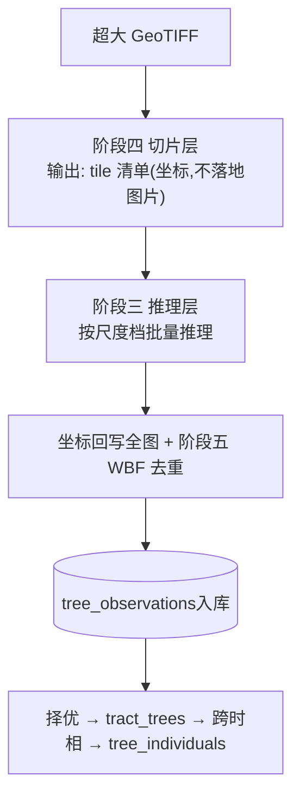
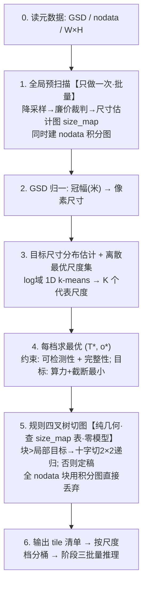
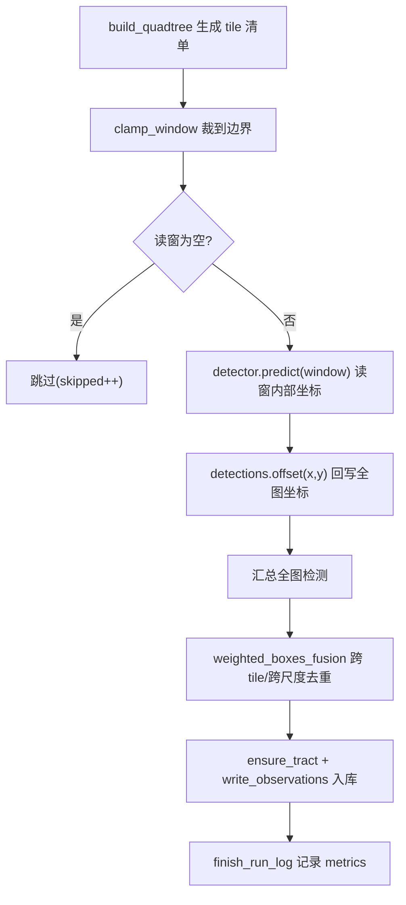

# 项目工作原理(文件A · 开发者解读)

> 面向**初次接触本项目的程序员**。目标:看完这一篇就能明白"为什么这么设计"与"数据怎么流起来"。
> 本文会**持续维护**:凡是代码里"不读注释就看不懂"的设计,都该在这里用文字讲清楚。

---

## 0. 一张图看懂整体数据流



---

## 1. 最重要的认知:项目里有**两种**"推理"

初读代码最容易混淆的一点。名字像,代价差几个数量级:

| | 预推理(预扫描) | 正式推理 |
|---|---|---|
| 目的 | 只为**估出局部树多大**(当"裁判") | 真正**检测每棵树** |
| 输入 | 降采样的粗图 | 切好的、尺寸合适的 tile |
| 代价 | 极廉价(LoG / 轻量模型 / CHM) | 昂贵(大模型 + GPU) |
| 跨几次 | 切图阶段可多次查 | 每个最终 tile **只跑一次** |

口诀:**预推理是裁判,正式推理是运动员。** 两者不是同一个模型。

---

## 2. 创新点 A(阶段四)完整工作流程

**要解决的事**:输入一张超大 GeoTIFF,输出一份 tile 清单(每个 tile 的 x,y + 边长 T + 重叠 o + 所属尺度档),交给阶段三批量推理。



逐步对应代码(`src/fourestds/preprocess/slicing.py`):

| 步 | 函数 | 说明 |
|---|---|---|
| 1 | `characteristic_scale` / `integral_image` | 裁判(需numpy,可选) + nodata 积分图 |
| 2 | `crown_px_size` | 冠幅(米)/GSD → 像素 |
| 3 | `cluster_scales` | log 域 1D k-means → 离散最优尺度集 |
| 4 | `optimize_tile_params` / `truncation_probability` | 约束优化求 (T*,o*) |
| 5 | `build_quadtree` | 规则四叉树 |
| 6 | (编排器消费) | 输出清单 |

---

## 3. 高频疑问(收集自评审问答)

### Q1. 四叉树是"边十字切图边预推理"还是"边切边正式推理"?
**都不是正式推理。** 正式推理始终在切图全部完成后,对定稿 tile **批量**跑一次。与切图交织的只可能是廉价的预扫描。

### Q2. 那是"切一下才预推理一下"吗?两种写法,我们选哪个?
- **写法A(采用)**:预扫描**一次性全做完**→ 生成 size_map;四叉树切图**纯查表**(零模型调用)。**所以没有"切一下预推理一下"的串行循环。**
- **写法B(不采用)**:每切一个节点就对该节点预扫描一次再递归。

两者切出的 tile **完全一样**,所以选 A,彻底解耦。`build_quadtree(target_size_fn=...)` 把裁判抽象成一个查表函数,正是为此。

### Q3. 谁来当裁判(预推理)?
三选一,从廉到精:(a)纯信号零模型——Lindeberg 归一化 LoG 特征尺度(默认);(b)轻量检测器/分水岭;(c)CHM 高度先验(最准最省,与创新点 B 协同)。裁判跑在降采样粗图上,代价比正式推理低 1~2 个数量级。

### Q4. "切一下预推理一下"会是时间瓶颈吗?
不会,且四叉树是**反**瓶颈的:
- 预扫描廉价且可并行(1/16~1/64 数据量,一次性全卷积)。
- 正式推理仍 100% 批量:K 个离散尺度 = 最多 K 个 batch 桶,GPU 利用整齐。
- 四叉树**减少**正式推理 tile 数(大树区用大 tile;nodata 区直接跳)。
- 唯一退化:裁判差/全是小树 → 一直细分到最小块,退化为均匀切,最坏也只是不亏。

### Q5. 为什么否决了"切尺寸地图"?
直接为每个像素预测一个 tile 尺寸形成连续"尺寸地图"不符合工程实践(边界碎裂、无法批量、不可证)。改用**离散最优尺度集 + 规则四叉树**:可批量、可证明最优、边界规整。

---

## 4. 三层单木模型为何这么分

核心是避免"重复推理污染":同一棵树在多张重叠子图、多次 run 中被反复检出。
- `tree_observations`:所有原始检出都进这里,**允许重复**,可追溯到具体 run 与切片。
- `tract_trees`:同一时相内择优去重,一棵树一条"权威"记录。
- `tree_individuals`:跨时相把同一个物理位置的树认为同一个个体,记录生长轨迹。

为何不用 observed_time?因为时相信息已在 `tracts.acquisition_time`,观测通过 `tract_id` 关联,冗余字段已删。

---

## 5. 关键函数索引(哪里看什么)

| 想了解 | 看这里 |
|---|---|
| 切片数学核心 | `preprocess/slicing.py` |
| 检测器接口/结果结构 | `detect/base.py` |
| 选架构/注册 | `detect/registry.py` |
| 三层建表 | `db/schema.py`(标准库) / `db/models.py`(ORM) |
| 后处理去重 | `postprocess/wbf.py` |
| 生命周期匹配 | `lifecycle/__init__.py` |
| CHM 求树高 | `fusion/__init__.py` |

---

## 维护说明

本文件与代码同步演进。**每当新增/修改了"需要解读才看得懂"的逻辑**(新算法、非直觉的设计取舍、跨模块约定),请同步在这里补一段文字说明,并在对应 commit 中一起提交。


---

## 阶段三:推理引擎是怎么串起来的(已实现)

这一层把“切片清单”变成“全图去重后的检测”,并落库为可追溯的观测。

### 模块分工

| 模块 | 职责 | 关键符号 |
| --- | --- | --- |
| `detect/base.py` | 检测器抽象与结果结构(纯 Python) | `Window`, `Detection`, `Detections`, `BaseDetector` |
| `detect/registry.py` | 后端注册表(延迟导入) | `register`, `get_detector`, `available_backends` |
| `detect/backends/mock.py` | 无依赖确定性检测器(端到端测试) | `MockDetector` |
| `detect/backends/yolo12.py` / `rtdetr.py` | 真实后端框架(推理 TODO) | `Yolo12Detector`, `RTDetrDetector` |
| `engine/runner.py` | 推理编排器 | `run_inference`, `SyntheticImageSource`, `InferenceResult` |
| `db/writer.py` | 观测/run 入库 | `start_run_log`, `ensure_tract`, `write_observations` |

### 一次 `infer` 的完整数据流



### 为什么这样设计(与工程要求的对应)

- **中间产物谨慎**:`run_inference` 不落地任何裁切图片;像素由 `image_source.read_window(x,y,w,h)` 按需提供。mock 后端压根不需像素。
- **边界兑底**:所有读窗经 `clamp_window` 裁剪;空图/超界/非法尺寸都不会崩溃。CLI `infer` 外层有 `try/except` 兑底,失败也会写 `run_logs.status=failed`。
- **依赖克制**:推理层核心(抽象/编排/去重/入库)全部纯标准库;torch/ultralytics/rasterio 仅在真实后端延迟导入。
- **可测试**:`mock` 后端 + `SyntheticImageSource` 让整条链路在无 GPU/无网环境跑通(`test_engine.py` + `scripts/smoke.py`)。

### 上手命令

```bash
# 无需真实影像/权重,端到端跑一次合成推理并入库
4estds infer --arch mock --width 4096 --height 4096 --demo-trees 60 \
    --acquisition-time 202406 --location demo-A
# 输出: tiles_total/processed, raw_count, fused_count, observations_written
```

真实后端(`yolo12`/`rtdetr`)的权重加载与 `predict` 解析以及真实影像 `read_window`(rasterio/PIL)为下一步 TODO。
