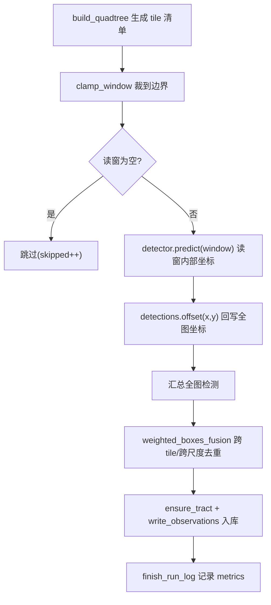

# 项目工作原理(文件A · 开发者解读)

> 面向**初次接触本项目的程序员**。目标:看完这一篇就能明白"为什么这么设计"与"数据怎么流起来"。
> 本文会**持续维护**:凡是代码里"不读注释就看不懂"的设计,都该在这里用文字讲清楚。

---

## 0. 一张图看懂整体数据流

```mermaid
flowchart TD
    A["超大 GeoTIFF"] --> B["阶段四 切片层<br>输出: tile 清单(坐标,不落地图片)"]
    B --> C["阶段三 推理层<br>按尺度档批量推理"]
    C --> D["坐标回写全图 + 阶段五 WBF 去重"]
    D --> E[("tree_observations入库")]
    E --> F["择优 → tract_trees → 跨时相 → tree_individuals"]
```## 2. 创新点 A(阶段四)完整工作流程

**要解决的事**: 输入一张超大 GeoTIFF，经过 SCOPE 尺度空间探测自标定，获取最优的切片大小 $T^*$ 和重叠率 $r^*$（以浮点比率表示），然后以此参数对影像进行静态均匀的重叠网格切片（tiling），最后交给推理引擎正式推理。

```mermaid
flowchart TD
    M["0. 读元数据: GSD / nodata / W×H"] --> P
    P["1. 空间分层网格采样<br>(提取若干种子窗口，并通过积分图做 nodata 舍弃)"] --> C
    C["2. 自相似四叉多尺度探针<br>(L0~L3级预推理，探测局部特征尺度分布)"] --> D
    D["3. 召回反卷积去偏估计<br>(用已知召回曲线纠正检测器尺寸统计偏差)"] --> E
    E["4. 最优切片几何寻优 (T*, r*)<br>(在离散格点空间求解联合目标博弈函数)"] --> F
    F["5. 全图静态均匀重叠切图<br>(所有像素强制采用整数运算，预计数量输出)"] --> G
    G["6. 瓦片输出落盘 / 内存推理 → WBF 去重融合并入库"]
```

逐步对应代码:

| 模块 / 步 | 文件与关键函数 | 说明 |
|---|---|---|
| 自标定探测 | `preprocess/scope.py` 中的 `run_scope_calibration` | 采样种子窗口、四叉多尺度探针切割、在线序贯停止监测 |
| 统计算法 | `preprocess/scope.py` 中的 `weighted_quantile` | 加权分位数无偏分布计算与大冠幅估算 |
| 几何求解 | `preprocess/slicing.py` 中的 `optimize_tile_params` | 在离散参数格点 $\mathcal{T} \times \mathcal{R}$ 上求解最优参数组合 $(T^*, r^*)$ |
| 均匀网格切片 | `preprocess/tiling.py` 中的 `execute_slicing` | 核心实现：以最优参数做全图均匀重叠切片落盘（至 `tiles__<image_stem>__run_<id>` 目录） |
| 推理编排 | `engine/runner.py` 中的 `run_inference` | 内存中对全图做均匀网格切片、分批送审、WBF融合去重 |

---

## 3. 高频疑问(收集自评审问答)

### Q1. 四叉树探针是用于全图切割吗？
**不是。** 四叉树（L0/L1/L2/L3）多尺度裁剪仅在 **SCOPE 自标定采样阶段** 对少量的采样种子窗口执行，用以收集不同分辨率下红树林的分布分布特征。
对整张超大影像进行最终的切片预处理（`preprocess` 阶段）和正式推理（`infer` 阶段）时，**一律使用根据最优参数 $(T^*, r^*)$ 算出的均匀重叠网格切片**，这避免了复杂的在线递归和推理边界错位，GPU 批处理效率最高。

### Q2. 为什么在代码里彻底用“重叠率”替代了“重合像素”？
因为重叠像素值（Overlap Pixels）会随着切片大小 $T$ 的变化而变化，不具备多尺度条件下的自适应可比性。我们将所有的重叠控制改用 **重叠率 (overlap_rate: float)** 进行统一：
- 计算重叠像素时由代码在内部统一取整：`overlap = int(round(tile_size * overlap_rate))`。
- 日志、命令行参数以及持久化均以重叠率（百分比）为主体展现，保持了数学表达与专利申报文案的绝对一致性。

### Q3. 如何保证全图切片时边缘树不被截断？
在最优几何求解时，引入了尺寸感知约束：
$$r \ge \frac{d_{q95}}{T}$$
其中 $d_{q95}$ 是真实尺寸分布中第 95% 分位数大树的冠幅尺寸。该约束强制使重叠区域宽度大于森林中绝大多数大树的直径。当大树跨越切片接缝时，重叠区能够保证该树至少在一张切片中被**完整**包含，进而在后续经 WBF 去重融合时能够以“完整框”的主导位置写回全图，而“截断框”会被打上 `truncated` 标记并受到乘积惩罚降权。

### Q4. 为什么否决了“连续非线性求解”方案，而采用离散网格寻优？
为了避免非凸目标函数陷入局部极小值，同时避免引入 `scipy.optimize` 这类沉重的第三方求解器（满足项目“依赖克制”原则）。直接在符合深度学习感受野（32倍数）的离散参数格点 $\mathcal{T} \times \mathcal{R}$ 上做遍历，执行仅需 $0.1\,\text{ms}$，在工程上具有最高的稳定性和运行效率。

---米)/GSD → 像素 |
| 3 | `cluster_scales` | log 域 1D k-means → 离散最优尺度集 |
| 4 | `optimize_tile_params` / `truncation_probability` | 约束优化求 (T*,o*) |
| 5 | `build_quadtree` | 规则四叉树 |
| 6 | (编排器消费) | 输出清单 |

---

## 3. 高频疑问(收集自评审问答)

### Q1. 四叉树是"边十字切图边预推理"还是"边切边正式推理"?
**都不是正式推理。** 正式推理始终在切图全部完成后,对定稿 tile **批量**跑一次。与切图交织的只可能是廉价的预扫描。

### Q2. 那是"切一下才预推理一下"吗?两种写法,我们选哪个?
- **写法A(采用)**:预扫描**一次性全做完**→ 生成 size_map;四叉树切图**纯查表**(零模型调用)。**所以没有"切一下预推理一下"的串行循环。**
- **写法B(不采用)**:每切一个节点就对该节点预扫描一次再递归。

两者切出的 tile **完全一样**,所以选 A,彻底解耦。`build_quadtree(target_size_fn=...)` 把裁判抽象成一个查表函数,正是为此。

### Q3. 谁来当裁判(预推理)?
三选一,从廉到精:(a)纯信号零模型——Lindeberg 归一化 LoG 特征尺度(默认);(b)轻量检测器/分水岭;(c)CHM 高度先验(最准最省,与创新点 B 协同)。裁判跑在降采样粗图上,代价比正式推理低 1~2 个数量级。

### Q4. "切一下预推理一下"会是时间瓶颈吗?
不会,且四叉树是**反**瓶颈的:
- 预扫描廉价且可并行(1/16~1/64 数据量,一次性全卷积)。
- 正式推理仍 100% 批量:K 个离散尺度 = 最多 K 个 batch 桶,GPU 利用整齐。
- 四叉树**减少**正式推理 tile 数(大树区用大 tile;nodata 区直接跳)。
- 唯一退化:裁判差/全是小树 → 一直细分到最小块,退化为均匀切,最坏也只是不亏。

### Q5. 为什么否决了"切尺寸地图"?
直接为每个像素预测一个 tile 尺寸形成连续"尺寸地图"不符合工程实践(边界碎裂、无法批量、不可证)。改用**离散最优尺度集 + 规则四叉树**:可批量、可证明最优、边界规整。

---

## 4. 三层单木模型为何这么分

核心是避免"重复推理污染":同一棵树在多张重叠子图、多次 run 中被反复检出。
- `tree_observations`:所有原始检出都进这里,**允许重复**,可追溯到具体 run 与切片。
- `tract_trees`:同一时相内择优去重,一棵树一条"权威"记录。
- `tree_individuals`:跨时相把同一个物理位置的树认为同一个个体,记录生长轨迹。

为何不用 observed_time?因为时相信息已在 `tracts.acquisition_time`,观测通过 `tract_id` 关联,冗余字段已删。

---

## 5. 关键函数索引(哪里看什么)

| 想了解 | 看这里 |
|---|---|
| 切片数学核心 | `preprocess/slicing.py` |
| 检测器接口/结果结构 | `detect/base.py` |
| 选架构/注册 | `detect/registry.py` |
| 三层建表 | `db/schema.py`(标准库) / `db/models.py`(ORM) |
| 后处理去重 | `postprocess/wbf.py` |
| 生命周期匹配 | `lifecycle/__init__.py` |
| CHM 求树高 | `fusion/__init__.py` |

---

## 维护说明

本文件与代码同步演进。**每当新增/修改了"需要解读才看得懂"的逻辑**(新算法、非直觉的设计取舍、跨模块约定),请同步在这里补一段文字说明,并在对应 commit 中一起提交。


---

## 阶段三:推理引擎是怎么串起来的(已实现)

这一层把“切片清单”变成“全图去重后的检测”,并落库为可追溯的观测。

### 模块分工

| 模块 | 职责 | 关键符号 |
| --- | --- | --- |
| `detect/base.py` | 检测器抽象与结果结构(纯 Python) | `Window`, `Detection`, `Detections`, `BaseDetector` |
| `detect/registry.py` | 后端注册表(延迟导入) | `register`, `get_detector`, `available_backends` |
| `detect/backends/mock.py` | 无依赖确定性检测器(端到端测试) | `MockDetector` |
| `detect/backends/yolo12.py` / `rtdetr.py` | 基于 ultralytics 的真实后端 | `Yolo12Detector`, `RTDetrDetector` |
| `detect/backends/ultralytics_common.py` | ultralytics 结果解析 + 通道转换 | `build_detections_from_result`, `ensure_bgr` |
| `engine/runner.py` | 推理编排器(分批) | `run_inference`, `SyntheticImageSource`, `InferenceResult` |
| `engine/sources.py` | 真实栓格影像源 | `RasterImageSource` |
| `db/writer.py` | 观测/run 入库 | `start_run_log`, `ensure_tract`, `write_observations` |

### 一次 `infer` 的完整数据流



### 为什么这样设计(与工程要求的对应)

- **中间产物谨慎**:`run_inference` 不落地任何裁切图片;像素由 `image_source.read_window(x,y,w,h)` 按需提供。mock 后端压根不需像素。
- **边界兑底**:所有读窗经 `clamp_window` 裁剪;空图/超界/非法尺寸都不会崩溃。CLI `infer` 外层有 `try/except` 兑底,失败也会写 `run_logs.status=failed`。
- **依赖克制**:推理层核心(抽象/编排/去重/入库)全部纯标准库;torch/ultralytics/rasterio 仅在真实后端延迟导入。
- **可测试**:`mock` 后端 + `SyntheticImageSource` 让整条链路在无 GPU/无网环境跑通(`test_engine.py` + `scripts/smoke.py`)。

### 上手命令

```bash
# 无需真实影像/权重,端到端跑一次合成推理并入库
4estds infer --arch mock --width 4096 --height 4096 --demo-trees 60 \
    --acquisition-time 202406 --location demo-A
# 输出: tiles_total/processed, raw_count, fused_count, observations_written
```

### 真实后端(yolo12 / rtdetr)与批量推理(已实现)

两个真实后端都基于 **ultralytics**(`YOLO` / `RTDETR`),接口与 mock 一致,可被 `--arch` 直接选择。

- **延迟导入 + 清晰报错**:`load()` 才 `import ultralytics`;未装时报 `ImportError` 并给出 `pip install '4estds[yolo]'` 类提示,不会在导入阶段崩。
- **结果解析统一**:`ultralytics_common.build_detections_from_result` 把 `result.boxes` 的 `xyxy/conf/cls` 转为本项目 `Detections`(读窗内部坐标),兼容 torch.Tensor / numpy。
- **通道约定**:`image_source` 读出 RGB,`ensure_bgr` 在送入 ultralytics 前转 BGR(cv2 习惯),避免预训权重色彩错位。
- **批量推理治瓶颈**:`BaseDetector.predict_batch` 默认逐窗;真实后端重写为一次 `model.predict([多个读窗])` 单次前向。`run_inference` 按 `batch_size` 分批,**每批只读该批读窗像素**,既提吞吐又把峰值内存限在 batch_size 个 tile。

### 真实影像源 `RasterImageSource`

- 优先 **rasterio**:`ds.read(window=...)` 做窗口读,不整图载入内存,适配超大 GeoTIFF,并携带 `transform/crs` 供后续像素->地理坐标。
- 缺 rasterio 时回退 **Pillow**(整图载入,会告警,仅适中小影像)。
- 读出统一为 RGB `(H, W, 3)`;空读窗返回 `None`。

### 上手命令(真实推理)

```bash
# 需先装重依赖: pip install '4estds[yolo]'  (或 [rtdetr] / [geo])
4estds infer --arch yolo12 --image /path/to/ortho.tif
```

> 沙箱无 torch/ultralytics/rasterio 且无外网,真实推理未在本仓实跑;但接口、结果解析、分批与回退逻辑均有单测覆盖(`test_engine.py`),装齐依赖后大概率即跑通。


## 阶段五：尺度感知后处理与边界去重（已实现）

切片推理后，同一棵树可能被多个读窗重复检出（尤其跨 tile 边界时）。阶段五把“简单几何 NMS”升级为 **尺度感知加权框融合（WBF）**，并在推理编排层加入**读窗外扩 + 截断框降权**。

### postprocess/wbf.py 做了什么

- `fuse(boxes, scores, *, labels, weights, iou_thr, conf_type, center_merge_frac)` 按置信度降序贪心聚簇：
  - **标签感知**：不同物种（labels）的框不会被当作重复合并，避免把相邻异种树压成一棵。
  - **坐标加权**：簇内坐标按 max(ε, score×weight) 加权平均，可靠框主导位置。
  - **conf_type**：max（取簇内最高分）或 avg（均值）。
  - **中心距离合并**：同心但大小悬殊时 IoU 偏低，center_merge_frac>0 时改用“中心距 ≤ frac×min(对角线)”补捕，解决多尺度档交界处同树的重复。
  - 返回 FusedBox(box, score, label, support, extra)，support 为簇内成员数。
- `weighted_boxes_fusion(boxes, scores, iou_thr)` 保留为薄封装（向后兼容旧调用与测试）。

### 推理编排（engine/runner.py）的变化

- 新增参数 overlap_px / conf_type / trunc_penalty。
- **读窗外扩**：overlap_px>0 时每个 tile 向四周外扩（裁到图边），让跨边界的树在相邻读窗中完整出现，交由 WBF 去重。
- **截断框标记与降权**：检出框触及“内部”窗口边缘（该边并非全图边界）时标为 truncated，融合时权重乘 trunc_penalty，避免被切半的框拉偏最终坐标。
- 输出保留物种 label，extra={"support": ...}，meta.fusion="wbf"。物种标签不再被压成统一 tree。

### 上手命令

```bash
# 读窗外扩 128px，跨 tile 边界树会在两个读窗被重复检出，WBF 再去重
4estds infer --arch mock --width 4096 --height 4096 --demo-trees 60 --overlap 128
# 例：raw_count=93（重叠产生重复）-> fused_count=60（准确去重回真值）
```

> 还未做（TODO）：soft-NMS / probabilistic-NMS 变体、按尺度档自适应 IoU 阈值、可学习融合权重。


## 阶段六：统计报告与批量处理

这一阶段把“已入库的观测”转化为人类可读的业务报告，并支撑多幅影像的批量生产。设计上严格分层：查询、计算、渲染三职责分离，便于单测与替换。

### 6.1 数据读取层 `db/reader.py`
- 只读查询层，纯 `sqlite3`（`row_factory=Row`），返回 `dict`，与写入层职责隔离。
- `resolve_tract_id`：支持直接传 `tract_id`，或用「采集时相(年月) + 位置」逻辑键反查（与阶段二的 plot 唯一键一致）。
- `latest_run_for_tract`：按 `started_at DESC` 取最近一次 run；`fetch_observations` 至少需 run_id 或 tract_id 之一。

### 6.2 指标层 `report/metrics.py`
- 纯函数 + `@dataclass ReportData`，无副作用、可独立单测。
- `species_composition`：物种计数并按降序排，空物种归为 unknown。
- `density_per_hectare`：面积≤0 或未知时返回 None（不编造虚假密度）。
- `scale_class_breakdown`：按 slice_size 分档统计占比，对应创新点 A 的离散尺度集。
- 所有分布统一复用日志模块的 `summarize_distribution`，与推理阶段口径一致（n/min/max/mean/median/p10/p90/std）。

### 6.3 渲染层 `report/render.py`
- `to_markdown` / `to_csv`：纯标准库，零额外依赖。
- `render_charts`：`matplotlib`（Agg 后端）生成物种柱状图 + 尺度档饼图；缺依赖时警告并返回空列表。
- `to_pdf`：`reportlab` 生成 A4 PDF 并嵌入图表；缺依赖时返回 None，由上层回退。

### 6.4 编排层 `report/generate_report`
- 串起 reader -> metrics -> render；`fmt=pdf` 但 reportlab 缺失时，**自动降级为 Markdown** 并在返回体标记 `fallback`。
- 默认输出目录为 `<home>/outputs`。

### 6.5 批量处理 `engine/batch.py`
- `discover_inputs`：纯函数，按后缀过滤 + 排序；目录不存在抛 `FileNotFoundError`。
- `run_batch`：**依赖注入**设计——注入 `source_factory`/`detector`/`writer`，便于用合成影像源单测；串行逐图，每图独立 run_id + run_log；单图异常捕获不中断整批，最后统一关闭影像源。

### 6.6 可靠性
- 新增单测：`tests/test_report.py`（6）+ `tests/test_batch.py`（4）；smoke 新增 `[report]`/`[batch]` 合计 9 项，全量 55/55 通过。
- 诚实边界：真实面积密度已接入（见 6.7）；观测的 slice_size 当前未逐检出框追写，尺度档统计在数据缺失时会呈现 unknown 档（不报错）。


### 6.7 地理仿射变换与真实面积 `geo/`
这是对“真实面积/密度”的补全，不再是 TODO。思路：从影像拿到仿射变换→算出像元地面尺寸(GSD)→乘像素数得地块真实面积→密度。

**三条获取路径**（按可靠性依次尝试，体现依赖克制）：
1. **rasterio dataset** 的 `transform`/`crs`（若已安装并打开）——最权威。
2. **sidecar 世界文件** `.tfw/.tifw/.wld`（6 个纯文本浮点）+ 可选 `.prj`(WKT) 判定坐标系与线性单位。
3. **内嵌 GeoTIFF 标签**：`ModelPixelScale(33550)` / `ModelTransformation(34264)` / `ModelTiepoint(33922)` / `GeoKeyDirectory(34735)`，纯 Pillow 读取，**无需 GDAL**。

**单位语义**严格区分几何（仿射变换）与坐标系：
- 投影坐标系（如 UTM）：像元尺寸本身是米，面积 = |det(仿射)| × 线性单位²（英尺等非米单位按 EPSG 码换算）。
- 地理坐标系（经纬度）：像元尺寸是度，在地块纬度 lat 处用 m_per_deg_lat≈111320、m_per_deg_lon≈111320·cos(lat) 近似换算为米并**显式告警**（结果为近似值）。

集成点：在 infer / batch 入库时调 `compute_tract_geometry(image_path, w, h, transform, crs)`，将 `gsd/geo_area/area_unit` 随地块持久化；报告层直接读 `geo_area` 算密度，“自动生效”。解析失败时记警告并保持面积置空的诚实降级。


## 阶段七:多源数据处理与融合指标提取(创新点 B,已实现)

正射影像（DOM）只能判定单木“树冠水平轮廓与中心坐标”，无法探测“单木高度与体积”。为了提取三维指标，本阶段将多源三维高程通道（CHM、DSM/DEM 双栅格、单独 DSM、激光点云 LAS/LAZ）与目标检测推理流水线深度融合。实现见 [chm.py](file:///home/ray/rays/repos/4estDS/src/forestds/fusion/chm.py)。

### 7.1 多渠道高程数据源的对齐与网格化

系统提供了三种高程数据输入组合，它们在底层统一被标准化生成为**冠层高度模型（Canopy Height Model, CHM）**：

1. **DOM + DSM + DEM (双栅格差分)**：
   * **执行逻辑**：同时传入高程栅格 DSM 和 DEM。若两图的分辨率或地理坐标范围不一致，系统自动调用 `rasterio.warp.reproject` 将 DEM 重投影并双线性插值对齐到 DSM 像素网格中。
   * **计算公式**：$\text{CHM} = \text{DSM} - \text{DEM}$（空值像元标记为 `NaN`，小于零的负值高度强制裁剪为 `0.0`，保证高度非负且不污染缺失值）。
2. **DOM + DSM (单独 DSM 模式)**：
   * **执行逻辑**：当用户无法提供精细的裸地 DEM 时，系统基于沿海/平原地形的常数背景假设，使用 `--dsm` 搭配常量高程背景 `--dem-default`（通过 `fusion.dem_default` 设定，默认 `0.0` 米）生成一个满值虚拟 DEM 高程矩阵。
   * **计算公式**：$\text{CHM} = \text{DSM} - \text{dem\_default}$。
3. **DOM + LAS/LAZ (激光点云模式)**：
   * **执行逻辑**：读取三维激光点云文件，首先进行**高程归一化（去地形起伏）**：提取点云分类，过滤出地面点（Class 2）。若未分类或地面点占比少于 $5\%$，自动退级启动形态学局部最低点拟合（以 $5\text{m}$ 粗网格的局部 Z 轴极小值作为虚拟地面）。
   * **插值计算基底**：基于地面点坐标构建 `cKDTree`，对任意点云点检索其最近的 3 个地面点，通过反距离权重（IDW, Inverse Distance Weighting）插值出其所在的局部基底高程 $Z_{\text{base}}$。从而求得点云的相对高度：$\text{Relative\_Z} = Z - Z_{\text{base}}$。
   * **网格化 CHM**：在点云自身地理范围内以 `fusion.las_grid_size`（默认 $0.05\text{m}$，即 5cm 级精度）划分网格，利用极速向量化算子 `np.maximum.at` 将落在格网内的最大点云高度填充为该网格像元值，生成精细的高分辨率 CHM 矩阵（无点区域设为 `NaN`）。

---

### 7.2 高度采样与体积估算方法（提供多选项与自动降级）

采样器 `CHMSampler` 负责将单木检测框由 DOM 的像素包围盒根据各自的地理仿射矩阵（`rgb_transform` 与 `chm_transform`）转换到 CHM 矩阵对应的地理切片 $W$ 中，并采样指标：

1. **树高采样（`height_stat`）**：
   在单木切片范围 $W$ 的所有有效像元（非 `NaN`）中计算统计高程。可选 `max`（默认）、`p95`（95%分位数，抗噪性强）、`mean`（均值）或 `median`（中位数）。如果算出的单木树高超过合理上限（120米），判定为噪点异常，自动剔除为异常偏离框。
2. **多模式树冠体积估算（`volume_method`）**：
   为了应对传统柱状积分高估树冠体积的问题，系统提供了以下 4 种估算方案（7 种具体算法），由用户通过配置文件自由选择：
   * **做法 A-1（栅格积分法）**：
     * **`"cbh"`（默认）**：**枝下高扣除积分法**。依据 $CBH = \text{cbh\_factor} \times H$（通过 `fusion.cbh_factor` 设置，默认 `0.3`），过滤并累加高度大于 $CBH$ 的网格像素，且每个像素扣除其树干高度：
       $$V_{\text{crown}} = \sum_{h_i \ge CBH} (h_i - CBH) \times A_{\text{pixel}}$$
     * **`"column"`**：**柱体总空间积分法**。不做扣除，直接累加大于 $0.5\text{m}$ 的网格柱状体积：
       $$V_{\text{canopy}} = \sum_{h_i \ge 0.5} h_i \times A_{\text{pixel}}$$
   * **做法 A-2（几何体三维解析体拟合法）**：
     计算检测框的实际地理宽度和长度，得到树冠平均半径 $r = \frac{\text{width\_geo} + \text{height\_geo}}{4}$，以及树冠厚度 $H_{\text{crown}} = H \times (1 - \text{cbh\_factor})$：
     * **`"paraboloid"`**（抛物面体拟合，常用于半开敞伞状树冠）：
       $$V = \frac{1}{2} \pi r^2 H_{\text{crown}}$$
     * **`"cone"`**（圆锥体拟合，常用于针叶林/塔状树冠）：
       $$V = \frac{1}{3} \pi r^2 H_{\text{crown}}$$
     * **`"ellipsoid"`**（半椭球体拟合，常用于阔叶林球形树冠）：
       $$V = \frac{2}{3} \pi r^2 H_{\text{crown}}$$
   * **做法 B-1（点云 3D 凸包法）**：
     * **`"convex_hull"`**（需 LAS 点云模式）：提取单木边界内高度 $\ge CBH$ 的所有三维激光点云，利用 `scipy.spatial.ConvexHull` 计算其真实包围的三维凸多面体体积。
     * **自动退级机制**：若有效点数少于 4 个或凸包构建失败（如点集处于同一平面），系统自动降级回退到 `"cbh"` 积分法。
   * **做法 B-2（点云 3D 体素化法）**：
     * **`"voxel"`**（需 LAS 点云模式）：以三维格网 `voxel_size`（默认 `0.2m`）划分单木三维空间，统计有激光点落入的非空三维格网总数，乘以单格体积得到总树冠物理体积。
     * **自动退级机制**：若单木边界内无任何有效点云点，系统自动降级回退到 `"cbh"` 积分法。

---

### 7.3 数据溯源与多源血缘记录

为了实现科研级数据回溯与质量评估，系统去除了单一的 `"chm"` 标注，在数据库字段 `height_source` 中根据高程源精度分级记录精确来源：
* **`"las"`**：激光雷达点云，具有厘米级超高测量精度。
* **`"dsm_dem"`**：基于精细 DSM+DEM 的地理差分，精度优良。
* **`"dsm_only"`**：在缺失 DEM 时通过常量替代估算，精度一般。
* **`"chm"`**：直接来自外部加载的 CHM 栅格影像采样。

同时，通过 `writer.register_source()` 接口，将每轮运行输入的多源文件路径与对应关系幂等登记进 `tract_sources` 表，确保数据血缘可追溯。

---

### 7.4 单波段载入 `load_single_band`

优先使用 `rasterio` 获取 nodata 和坐标仿射变换。若未安装依赖，则安全降级为 `Pillow F-mode` 载入高程值，并利用 `geo.resolve_geo` 解析 sidecar 文件（.tfw/.prj）或内嵌 GeoTIFF 标签获取空间范围。无 GDAL 底层支持依然可物理采样。

---

### 7.5 集成点 `cli.py infer`

* `infer` 子命令全面支持参数：`--chm`、`--dsm`、`--dem`、`--las`、`--las-grid-size`、`--dem-default`。通过命令行或配置文件，系统自适应地将检测结果在推理过程中送入采样器标注。
* **报告呈现**：经高程指标估算得到的树高与体积信息，会自动登记入库并输出在推理报告中（包含树高和树冠体积的直观分布统计）。

---

### 7.6 验证

* **单元测试（`tests/test_fusion.py`）**：覆盖了 CHM 的 NaN 运算、负值截断、DSM/DEM 重采样对齐、LAS 地面 IDW 树高归一化、以及各种几何公式、凸包体素化的计算精度与越界处理。
* **端到端运行验证**：推理主链路对各模式支持良好，日志展示出完备的体积统计量，且数据与来源血缘均正确幂等回写至 SQLite。

## 阶段八：单木生命周期追踪（创新点 C，项目核心，已实现）

这是整个系统最具科研/商业价值的一步：把同一 location 多个时相的检测结果连成“同一棵树”的轨迹，进而给出生长、新生与枯死。代码在 `src/forestds/lifecycle/`，拆为纯函数的匹配层与追踪层，便于单测与后续替换。

### 8.1 匹配求解器 `lifecycle/matching.py`
- `linear_sum_assignment(cost)`：**自实现的指派问题最优求解**（标准 O(n²m) 潜势法/医牛利算法）。沙箱无 scipy，故不依赖 `scipy.optimize`；支持矩形代价矩阵（行>列时自动转置），仅返回 min(n,m) 个配对。本地装了 scipy 后可无缝替换为同名函数。
- `TreeRecord`：参与匹配的单木最小表示（key/位置 x,y/树高/冠幅/物种）。位置可为像素或世界坐标，只要同一参系。
- `build_cost_matrix`：逐对代价 = `w_pos·(d/max_dist)` + `w_crown·冠幅相对差` + `w_height·树高相对差` + 物种不符惩罚。**位置门控**：超过 `max_dist` 的配对赋有限大值 `_BIG`（不用 inf，避免污染潜势迭代）。
- `match_trees`：默认医牛利最优求解；当规模 `n×m` 超过阈值（`_GREEDY_CELL_LIMIT`）或显式 `use_hungarian=False` 时回退贪婪，兼顾极大地块的吞吐。求解后只接受门控内（代价<`_BIG`）的配对；未配对的 prev=**枯死/遗漏**、curr=**新生**。全程日志记录求解器/配对数/新生/枯死/总代价。

### 8.2 追踪编排与生长轨迹 `lifecycle/tracking.py`
- `track_sequence(snapshots, location_cluster, max_dist, ...)`：输入是按时间升序的 `[(采集时相, [TreeRecord...]), ...]`。首期全部视为新生；后续每期与当前存活个体集合做一次 `match_trees`：
  - **配对** → 延续同一 `individual_id`，追加生长点，更新 `last_seen`；
  - **prev 未配对** → 标记 `status=dead`（不再进入下期候选）；
  - **curr 未配对** → 新建个体（新生）。
- `Individual.height_growth_rate()`：以时相序号为自变量、树高为因变量做**线性拟合**（`numpy.polyfit` 一次项），得到生长率（m/时相）；无 numpy 时降级为首尾差商，不足两点返回 `None`。
- `Individual.to_growth_json()`：序列化为 `{points:[{time,height,crown,obs_key}], height_growth_rate, n_observations}`，直接存入 `tree_individuals.growth_json`。

### 8.3 持久化 `db/writer.py`
- `consolidate_tract_trees(tract_id, run_id, observations)`：把某次 run 的观测整理为地块**规范单木** `tract_trees`（幂等：先清空该地块再重建），`chosen_obs_id` 指向原始观测，保留 height/crown/几何。
- `persist_individuals(individuals)`：`INSERT ... ON CONFLICT(individual_id) DO UPDATE` 上譮 `tree_individuals`；再按每个体的 `members[time]=obs_key` 把 `tract_trees.individual_id` 回填（跨时相身份与某期规范株挂钩）。
- `parse_point('POINT(cx cy)')`：容错解析几何点，解析失败返回 `None`（该棵不进入匹配）。

### 8.4 集成点 `cli.py track`
- `track --location L [--max-dist 20] [--greedy]`：按 location 拉取所有时相地块并按采集时相排序 → 逐地块取最近 run 的观测、整理规范株、构建 `TreeRecord` 快照 → `track_sequence` 跨时相追踪 → `persist_individuals` 落库。`max_dist` 为像素门控，`--greedy` 切换为贪婪。完成后日志汇报个体数/存活/枯死/新生/配对次/平均生长率。

### 8.5 验证
- `tests/test_lifecycle_tracking.py` 10 项：医牛利已知矩阵最优解、矩形（行>列 / 列>行）、空输入、代价门控、基本匹配+新生、枯死、**靠树高歧义消除**、三期追踪（生长率>0/枯死识别）、growth_json 序列化。全部通过；smoke 全量 61/61 保持通过。
- 端到端（自包含）：mock 造 3 个时相（202301/202401/202501）同一 location 各 36 株 → `track` 后数据库 `tree_individuals=36`、`tract_trees=108` **全部回填 individual_id**、样例个体跨 202301→202501 存活且拥有 3 个生长点。
- 说明：mock 无 CHM 树高时生长率为 `None`（诚实降级）；接入阶段七的 `--dsm/--dem` 后即可产出真实生长轨迹。

### 8.6 边界与后续
- 当前匹配代价基于位置+冠幅+树高+物种；引入物种分类（阶段七多光谱）后可加大物种权重。
- 生长拟合目前为线性；多期数据积累后可升级为非线性生长曲线（如 Logistic/Richards）。
- 跨时相配准假定同一 location 已空间对齐；实际生产中可在进入匹配前加一步全局配准（TODO）。
