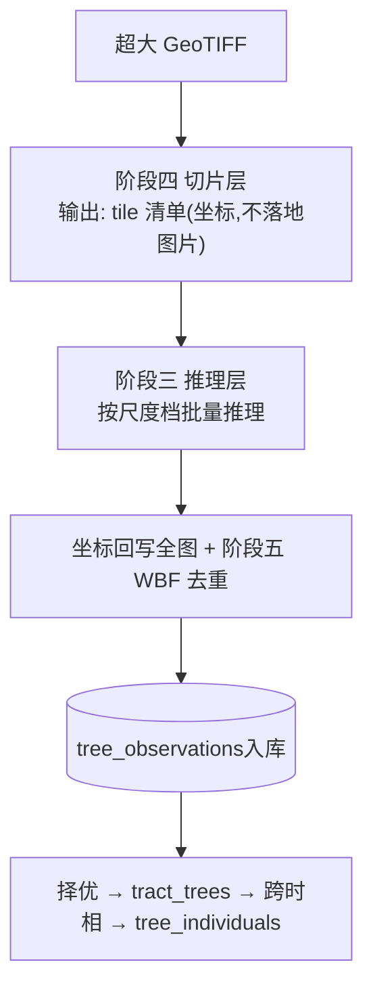
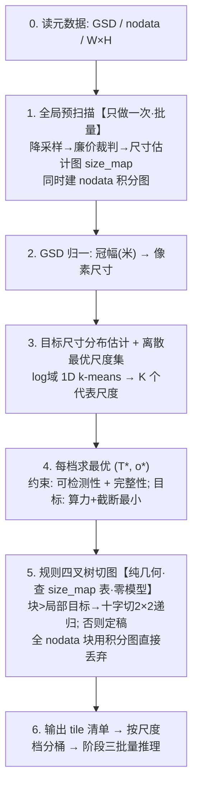
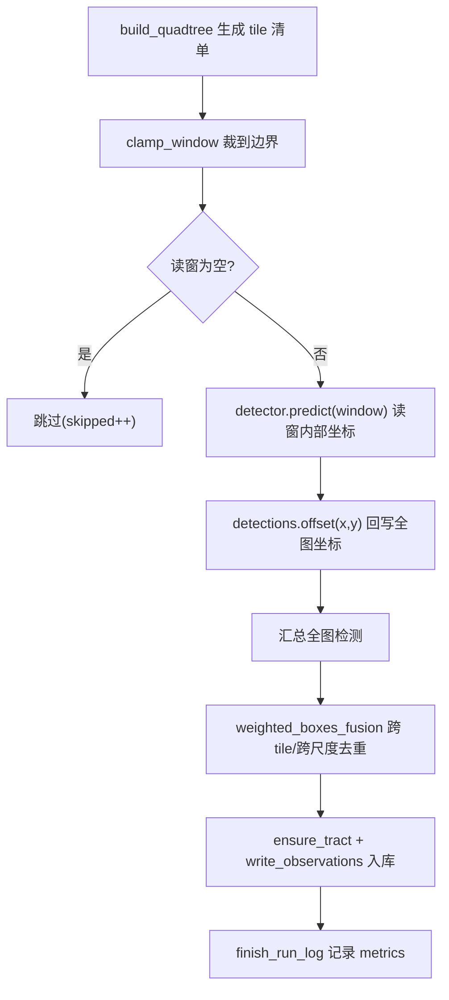

# 项目工作原理(文件A · 开发者解读)

> 面向**初次接触本项目的程序员**。目标:看完这一篇就能明白"为什么这么设计"与"数据怎么流起来"。
> 本文会**持续维护**:凡是代码里"不读注释就看不懂"的设计,都该在这里用文字讲清楚。

---

## 0. 一张图看懂整体数据流



---

## 1. 最重要的认知:项目里有**两种**"推理"

初读代码最容易混淆的一点。名字像,代价差几个数量级:

| | 预推理(预扫描) | 正式推理 |
|---|---|---|
| 目的 | 只为**估出局部树多大**(当"裁判") | 真正**检测每棵树** |
| 输入 | 降采样的粗图 | 切好的、尺寸合适的 tile |
| 代价 | 极廉价(LoG / 轻量模型 / CHM) | 昂贵(大模型 + GPU) |
| 跨几次 | 切图阶段可多次查 | 每个最终 tile **只跑一次** |

口诀:**预推理是裁判,正式推理是运动员。** 两者不是同一个模型。

---

## 2. 创新点 A(阶段四)完整工作流程

**要解决的事**:输入一张超大 GeoTIFF,输出一份 tile 清单(每个 tile 的 x,y + 边长 T + 重叠 o + 所属尺度档),交给阶段三批量推理。



逐步对应代码(`src/fourestds/preprocess/slicing.py`):

| 步 | 函数 | 说明 |
|---|---|---|
| 1 | `characteristic_scale` / `integral_image` | 裁判(需numpy,可选) + nodata 积分图 |
| 2 | `crown_px_size` | 冠幅(米)/GSD → 像素 |
| 3 | `cluster_scales` | log 域 1D k-means → 离散最优尺度集 |
| 4 | `optimize_tile_params` / `truncation_probability` | 约束优化求 (T*,o*) |
| 5 | `build_quadtree` | 规则四叉树 |
| 6 | (编排器消费) | 输出清单 |

---

## 3. 高频疑问(收集自评审问答)

### Q1. 四叉树是"边十字切图边预推理"还是"边切边正式推理"?
**都不是正式推理。** 正式推理始终在切图全部完成后,对定稿 tile **批量**跑一次。与切图交织的只可能是廉价的预扫描。

### Q2. 那是"切一下才预推理一下"吗?两种写法,我们选哪个?
- **写法A(采用)**:预扫描**一次性全做完**→ 生成 size_map;四叉树切图**纯查表**(零模型调用)。**所以没有"切一下预推理一下"的串行循环。**
- **写法B(不采用)**:每切一个节点就对该节点预扫描一次再递归。

两者切出的 tile **完全一样**,所以选 A,彻底解耦。`build_quadtree(target_size_fn=...)` 把裁判抽象成一个查表函数,正是为此。

### Q3. 谁来当裁判(预推理)?
三选一,从廉到精:(a)纯信号零模型——Lindeberg 归一化 LoG 特征尺度(默认);(b)轻量检测器/分水岭;(c)CHM 高度先验(最准最省,与创新点 B 协同)。裁判跑在降采样粗图上,代价比正式推理低 1~2 个数量级。

### Q4. "切一下预推理一下"会是时间瓶颈吗?
不会,且四叉树是**反**瓶颈的:
- 预扫描廉价且可并行(1/16~1/64 数据量,一次性全卷积)。
- 正式推理仍 100% 批量:K 个离散尺度 = 最多 K 个 batch 桶,GPU 利用整齐。
- 四叉树**减少**正式推理 tile 数(大树区用大 tile;nodata 区直接跳)。
- 唯一退化:裁判差/全是小树 → 一直细分到最小块,退化为均匀切,最坏也只是不亏。

### Q5. 为什么否决了"切尺寸地图"?
直接为每个像素预测一个 tile 尺寸形成连续"尺寸地图"不符合工程实践(边界碎裂、无法批量、不可证)。改用**离散最优尺度集 + 规则四叉树**:可批量、可证明最优、边界规整。

---

## 4. 三层单木模型为何这么分

核心是避免"重复推理污染":同一棵树在多张重叠子图、多次 run 中被反复检出。
- `tree_observations`:所有原始检出都进这里,**允许重复**,可追溯到具体 run 与切片。
- `tract_trees`:同一时相内择优去重,一棵树一条"权威"记录。
- `tree_individuals`:跨时相把同一个物理位置的树认为同一个个体,记录生长轨迹。

为何不用 observed_time?因为时相信息已在 `tracts.acquisition_time`,观测通过 `tract_id` 关联,冗余字段已删。

---

## 5. 关键函数索引(哪里看什么)

| 想了解 | 看这里 |
|---|---|
| 切片数学核心 | `preprocess/slicing.py` |
| 检测器接口/结果结构 | `detect/base.py` |
| 选架构/注册 | `detect/registry.py` |
| 三层建表 | `db/schema.py`(标准库) / `db/models.py`(ORM) |
| 后处理去重 | `postprocess/wbf.py` |
| 生命周期匹配 | `lifecycle/__init__.py` |
| CHM 求树高 | `fusion/__init__.py` |

---

## 维护说明

本文件与代码同步演进。**每当新增/修改了"需要解读才看得懂"的逻辑**(新算法、非直觉的设计取舍、跨模块约定),请同步在这里补一段文字说明,并在对应 commit 中一起提交。


---

## 阶段三:推理引擎是怎么串起来的(已实现)

这一层把“切片清单”变成“全图去重后的检测”,并落库为可追溯的观测。

### 模块分工

| 模块 | 职责 | 关键符号 |
| --- | --- | --- |
| `detect/base.py` | 检测器抽象与结果结构(纯 Python) | `Window`, `Detection`, `Detections`, `BaseDetector` |
| `detect/registry.py` | 后端注册表(延迟导入) | `register`, `get_detector`, `available_backends` |
| `detect/backends/mock.py` | 无依赖确定性检测器(端到端测试) | `MockDetector` |
| `detect/backends/yolo12.py` / `rtdetr.py` | 基于 ultralytics 的真实后端 | `Yolo12Detector`, `RTDetrDetector` |
| `detect/backends/ultralytics_common.py` | ultralytics 结果解析 + 通道转换 | `build_detections_from_result`, `ensure_bgr` |
| `engine/runner.py` | 推理编排器(分批) | `run_inference`, `SyntheticImageSource`, `InferenceResult` |
| `engine/sources.py` | 真实栓格影像源 | `RasterImageSource` |
| `db/writer.py` | 观测/run 入库 | `start_run_log`, `ensure_tract`, `write_observations` |

### 一次 `infer` 的完整数据流



### 为什么这样设计(与工程要求的对应)

- **中间产物谨慎**:`run_inference` 不落地任何裁切图片;像素由 `image_source.read_window(x,y,w,h)` 按需提供。mock 后端压根不需像素。
- **边界兑底**:所有读窗经 `clamp_window` 裁剪;空图/超界/非法尺寸都不会崩溃。CLI `infer` 外层有 `try/except` 兑底,失败也会写 `run_logs.status=failed`。
- **依赖克制**:推理层核心(抽象/编排/去重/入库)全部纯标准库;torch/ultralytics/rasterio 仅在真实后端延迟导入。
- **可测试**:`mock` 后端 + `SyntheticImageSource` 让整条链路在无 GPU/无网环境跑通(`test_engine.py` + `scripts/smoke.py`)。

### 上手命令

```bash
# 无需真实影像/权重,端到端跑一次合成推理并入库
4estds infer --arch mock --width 4096 --height 4096 --demo-trees 60 \
    --acquisition-time 202406 --location demo-A
# 输出: tiles_total/processed, raw_count, fused_count, observations_written
```

### 真实后端(yolo12 / rtdetr)与批量推理(已实现)

两个真实后端都基于 **ultralytics**(`YOLO` / `RTDETR`),接口与 mock 一致,可被 `--arch` 直接选择。

- **延迟导入 + 清晰报错**:`load()` 才 `import ultralytics`;未装时报 `ImportError` 并给出 `pip install '4estds[yolo]'` 类提示,不会在导入阶段崩。
- **结果解析统一**:`ultralytics_common.build_detections_from_result` 把 `result.boxes` 的 `xyxy/conf/cls` 转为本项目 `Detections`(读窗内部坐标),兼容 torch.Tensor / numpy。
- **通道约定**:`image_source` 读出 RGB,`ensure_bgr` 在送入 ultralytics 前转 BGR(cv2 习惯),避免预训权重色彩错位。
- **批量推理治瓶颈**:`BaseDetector.predict_batch` 默认逐窗;真实后端重写为一次 `model.predict([多个读窗])` 单次前向。`run_inference` 按 `batch_size` 分批,**每批只读该批读窗像素**,既提吞吐又把峰值内存限在 batch_size 个 tile。

### 真实影像源 `RasterImageSource`

- 优先 **rasterio**:`ds.read(window=...)` 做窗口读,不整图载入内存,适配超大 GeoTIFF,并携带 `transform/crs` 供后续像素->地理坐标。
- 缺 rasterio 时回退 **Pillow**(整图载入,会告警,仅适中小影像)。
- 读出统一为 RGB `(H, W, 3)`;空读窗返回 `None`。

### 上手命令(真实推理)

```bash
# 需先装重依赖: pip install '4estds[yolo]'  (或 [rtdetr] / [geo])
4estds infer --arch yolo12 --image /path/to/ortho.tif
```

> 沙箱无 torch/ultralytics/rasterio 且无外网,真实推理未在本仓实跑;但接口、结果解析、分批与回退逻辑均有单测覆盖(`test_engine.py`),装齐依赖后大概率即跑通。


## 阶段五：尺度感知后处理与边界去重（已实现）

切片推理后，同一棵树可能被多个读窗重复检出（尤其跨 tile 边界时）。阶段五把“简单几何 NMS”升级为 **尺度感知加权框融合（WBF）**，并在推理编排层加入**读窗外扩 + 截断框降权**。

### postprocess/wbf.py 做了什么

- `fuse(boxes, scores, *, labels, weights, iou_thr, conf_type, center_merge_frac)` 按置信度降序贪心聚簇：
  - **标签感知**：不同物种（labels）的框不会被当作重复合并，避免把相邻异种树压成一棵。
  - **坐标加权**：簇内坐标按 max(ε, score×weight) 加权平均，可靠框主导位置。
  - **conf_type**：max（取簇内最高分）或 avg（均值）。
  - **中心距离合并**：同心但大小悬殊时 IoU 偏低，center_merge_frac>0 时改用“中心距 ≤ frac×min(对角线)”补捕，解决多尺度档交界处同树的重复。
  - 返回 FusedBox(box, score, label, support, extra)，support 为簇内成员数。
- `weighted_boxes_fusion(boxes, scores, iou_thr)` 保留为薄封装（向后兼容旧调用与测试）。

### 推理编排（engine/runner.py）的变化

- 新增参数 overlap_px / conf_type / trunc_penalty。
- **读窗外扩**：overlap_px>0 时每个 tile 向四周外扩（裁到图边），让跨边界的树在相邻读窗中完整出现，交由 WBF 去重。
- **截断框标记与降权**：检出框触及“内部”窗口边缘（该边并非全图边界）时标为 truncated，融合时权重乘 trunc_penalty，避免被切半的框拉偏最终坐标。
- 输出保留物种 label，extra={"support": ...}，meta.fusion="wbf"。物种标签不再被压成统一 tree。

### 上手命令

```bash
# 读窗外扩 128px，跨 tile 边界树会在两个读窗被重复检出，WBF 再去重
4estds infer --arch mock --width 4096 --height 4096 --demo-trees 60 --overlap 128
# 例：raw_count=93（重叠产生重复）-> fused_count=60（准确去重回真值）
```

> 还未做（TODO）：soft-NMS / probabilistic-NMS 变体、按尺度档自适应 IoU 阈值、可学习融合权重。


## 阶段六：统计报告与批量处理

这一阶段把“已入库的观测”转化为人类可读的业务报告，并支撑多幅影像的批量生产。设计上严格分层：查询、计算、渲染三职责分离，便于单测与替换。

### 6.1 数据读取层 `db/reader.py`
- 只读查询层，纯 `sqlite3`（`row_factory=Row`），返回 `dict`，与写入层职责隔离。
- `resolve_tract_id`：支持直接传 `tract_id`，或用「采集时相(年月) + 位置」逻辑键反查（与阶段二的 plot 唯一键一致）。
- `latest_run_for_tract`：按 `started_at DESC` 取最近一次 run；`fetch_observations` 至少需 run_id 或 tract_id 之一。

### 6.2 指标层 `report/metrics.py`
- 纯函数 + `@dataclass ReportData`，无副作用、可独立单测。
- `species_composition`：物种计数并按降序排，空物种归为 unknown。
- `density_per_hectare`：面积≤0 或未知时返回 None（不编造虚假密度）。
- `scale_class_breakdown`：按 slice_size 分档统计占比，对应创新点 A 的离散尺度集。
- 所有分布统一复用日志模块的 `summarize_distribution`，与推理阶段口径一致（n/min/max/mean/median/p10/p90/std）。

### 6.3 渲染层 `report/render.py`
- `to_markdown` / `to_csv`：纯标准库，零额外依赖。
- `render_charts`：`matplotlib`（Agg 后端）生成物种柱状图 + 尺度档饼图；缺依赖时警告并返回空列表。
- `to_pdf`：`reportlab` 生成 A4 PDF 并嵌入图表；缺依赖时返回 None，由上层回退。

### 6.4 编排层 `report/generate_report`
- 串起 reader -> metrics -> render；`fmt=pdf` 但 reportlab 缺失时，**自动降级为 Markdown** 并在返回体标记 `fallback`。
- 默认输出目录为 `<home>/outputs`。

### 6.5 批量处理 `engine/batch.py`
- `discover_inputs`：纯函数，按后缀过滤 + 排序；目录不存在抛 `FileNotFoundError`。
- `run_batch`：**依赖注入**设计——注入 `source_factory`/`detector`/`writer`，便于用合成影像源单测；串行逐图，每图独立 run_id + run_log；单图异常捕获不中断整批，最后统一关闭影像源。

### 6.6 可靠性
- 新增单测：`tests/test_report.py`（6）+ `tests/test_batch.py`（4）；smoke 新增 `[report]`/`[batch]` 合计 9 项，全量 55/55 通过。
- 诚实边界：真实面积密度已接入（见 6.7）；观测的 slice_size 当前未逐检出框追写，尺度档统计在数据缺失时会呈现 unknown 档（不报错）。


### 6.7 地理仿射变换与真实面积 `geo/`
这是对“真实面积/密度”的补全，不再是 TODO。思路：从影像拿到仿射变换→算出像元地面尺寸(GSD)→乘像素数得地块真实面积→密度。

**三条获取路径**（按可靠性依次尝试，体现依赖克制）：
1. **rasterio dataset** 的 `transform`/`crs`（若已安装并打开）——最权威。
2. **sidecar 世界文件** `.tfw/.tifw/.wld`（6 个纯文本浮点）+ 可选 `.prj`(WKT) 判定坐标系与线性单位。
3. **内嵌 GeoTIFF 标签**：`ModelPixelScale(33550)` / `ModelTransformation(34264)` / `ModelTiepoint(33922)` / `GeoKeyDirectory(34735)`，纯 Pillow 读取，**无需 GDAL**。

**单位语义**严格区分几何（仿射变换）与坐标系：
- 投影坐标系（如 UTM）：像元尺寸本身是米，面积 = |det(仿射)| × 线性单位²（英尺等非米单位按 EPSG 码换算）。
- 地理坐标系（经纬度）：像元尺寸是度，在地块纬度 lat 处用 m_per_deg_lat≈111320、m_per_deg_lon≈111320·cos(lat) 近似换算为米并**显式告警**（结果为近似值）。

集成点：在 infer / batch 入库时调 `compute_tract_geometry(image_path, w, h, transform, crs)`，将 `gsd/geo_area/area_unit` 随地块持久化；报告层直接读 `geo_area` 算密度，“自动生效”。解析失败时记警告并保持面积置空的诚实降级。


## 阶段七:多源融合——RGB × CHM 树高(创新点 B,已实现)

RGB 正射只能判“在哪、是不是树”,判不了“多高”。树高来自高程差:**CHM(冠层高度模型)= DSM(地表/含树冠高程) − DEM(裸地高程)**。本阶段把 CHM 树高接入检测→入库主链路,实现见 `src/fourestds/fusion/chm.py`,全程走统一日志系统。

### 7.1 CHM 计算 `chm_from_dsm_dem`
- `CHM = DSM − DEM`;`dsm_nodata/dem_nodata` 命中处置 NaN;`clip_negative=True` 把负高(配准误差/水面)裁到 0,但 **NaN 保持 NaN**(不污染统计)。
- 形状不一致直接抛 `ValueError`(快速失败,不静默错配)。也提供标量版 `tree_height_from_chm(dsm,dem)=max(0,DSM−DEM)` 供单测/调试。

### 7.2 高度采样 `sample_height` / `CHMSampler`
- `sample_height(chm, cx, cy, half_win, stat)`:在检测框中心 ±half_win 像素窗口内,忽略 NaN,按 `p95/max/median/mean` 估高。**默认 p95**——对冠顶稳健,既抑制单像素噪声,又不像 mean 那样被冠缘低值拉低。越界或窗口全 nodata 返回 `None`。
- `CHMSampler` 负责把 RGB 检测框映射到 CHM 像素:
  - **跨分辨率配准**:RGB 与 CHM 分辨率/范围常不同。给定两者仿射变换时,走 `RGB px → world(pixel_to_world) → CHM px(world_to_pixel)`,严格按地理坐标对齐;缺仿射信息时降级为 1:1 像素对齐假设。
  - **窗口自适应**:采样半窗按检测框尺寸(约冠幅 1/4)推算,并按 RGB/CHM 像素尺寸比缩放,保证物理口径一致。
  - **兜底分级**:返回 `height_source ∈ {chm, chm_nodata, chm_outlier}`——超过合理上限(120m,远高于红树林实际)判为配准/数据异常,**宁可不写也不写脏数据**。
- `annotate(detections)` 把 `height/height_source` 写入每个检测的 `extra`,并用 `log_distribution` 打印一行树高分布(n/min/median/mean/p90/max/std),复用阶段三的分布工具。

### 7.3 单波段载入 `load_single_band`
- rasterio 优先(读 nodata + crs/transform),缺失时 **Pillow `convert("F")` 降级**整图载入,并复用 `geo.resolve_geo` 解析 sidecar/GeoTIFF 标签拿仿射。无 GDAL 也能跑。

### 7.4 入库与多源登记 `db/writer.py`
- `write_observations` 从 `d.extra` 读取 `height/height_source` 写入 `tree_observations`(新增两列已在 schema)。
- `register_source(tract_id, source_type, path)` 把 RGB/CHM/DSM/DEM 文件按 `(tract, type, path)` **幂等**登记进 `tract_sources`,留存数据血缘。

### 7.5 集成点 `cli.py infer`
- `infer` 新增 `--chm PATH` 或 `--dsm PATH --dem PATH`:构建 CHM → 用 RGB 仿射(来自影像源或 `compute_tract_geometry`)建 `CHMSampler` → 标注树高 → 登记多源 → 随观测入库。报告层第④节“置信度与树高”随之自动有值。
- 批量 CHM 列为后续扩展(每图配套 CHM/DSM/DEM 的目录约定)。

### 7.6 验证
- `tests/test_fusion.py` 9 项:CHM 计算/nodata/负值裁剪、形状校验、标量树高、窗口统计量/越界/全 nodata、像素对齐采样、**跨分辨率仿射配准**(RGB 0.5m/px ↔ CHM 1.0m/px)、超限判异常、annotate 写 extra、仿射逆变换往返。smoke 全量保持通过。
- 端到端:mock 推理 + `--dsm/--dem`,40 株全部取到树高,`height_source=chm`,DSM/DEM 登记入 `tract_sources`,树高分布日志正常输出。
